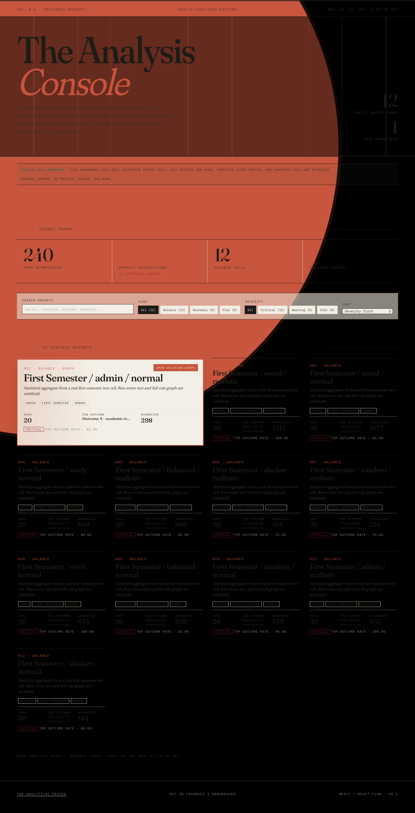
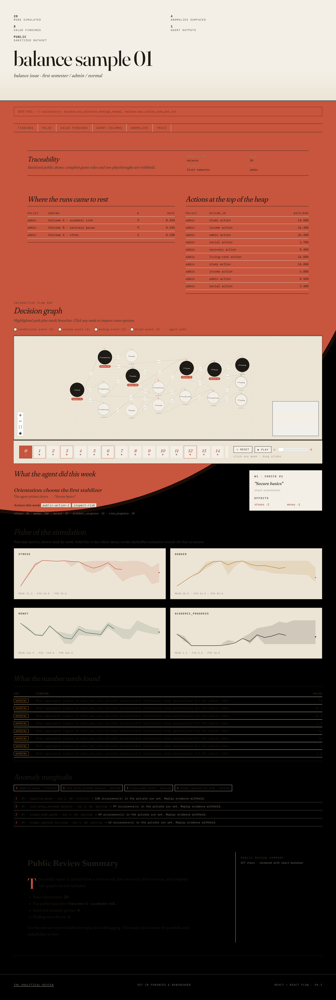
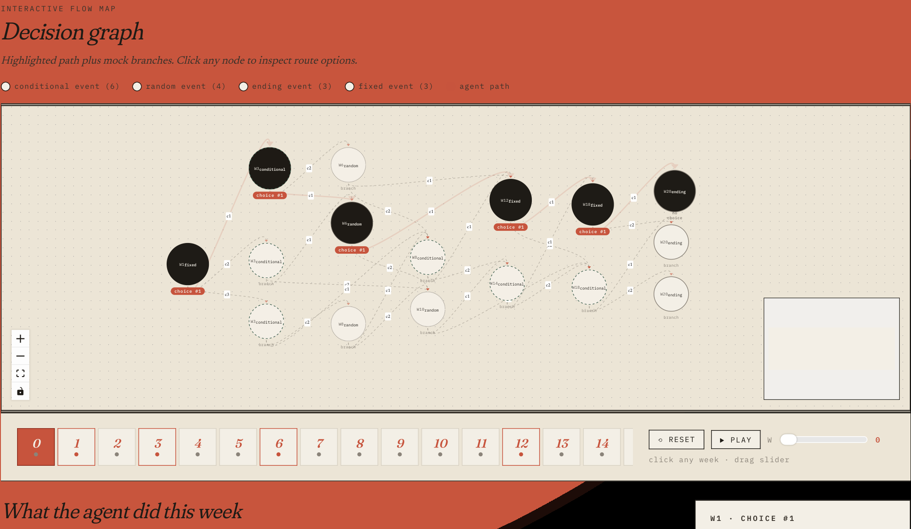

# game_analysis_agent

Development-side AI agent pipeline for simulation games. The current reference
integration is the Godot `study-in-germany` demo, but the project is structured
as a reusable game QA agent framework for balance testing, boundary probing,
bug discovery, value analysis, quality gates, and interactive LLM playtesting.



| Report view | Decision graph |
| --- | --- |
|  |  |

PDF exports are kept in [docs/assets/dashboard-preview.pdf](docs/assets/dashboard-preview.pdf)
and [docs/assets/decision-graph-preview.pdf](docs/assets/decision-graph-preview.pdf).

The agent is not embedded in the game runtime as an NPC. Instead, it runs beside
the game as a QA and design-review system:

```text
Godot headless game runners
  ├─ Monte Carlo simulation
  ├─ boundary/extreme-state probes
  ├─ event/action/ending graph export
  └─ interactive probe driven by an LLM player
        │
        ▼
Python analysis layer
  ├─ ending, weekly metric, action, event, and choice statistics
  ├─ anomaly and invariant detection
  ├─ value/playability analysis
  ├─ quality gates
  └─ traceable report manifests
        │
        ▼
LLM agent layer
  ├─ balance
  ├─ content_qa
  ├─ event_graph
  ├─ bug_hunter
  ├─ boundary_prober
  ├─ value_reviewer
  └─ interactive_player
        │
        ▼
Reports and dashboard
  ├─ Markdown / JSON / CSV reports
  ├─ report_manifest.json + reports/report_index.json
  ├─ static HTML dashboard
  └─ React + React Flow dashboard
```

The default local LLM backend is an OpenAI-compatible vLLM server. The Docker
Compose stack is configured for NVIDIA's Qwen3.6 27B NVFP4 checkpoint with
ModelOpt quantization, Qwen3 reasoning parsing, and optional MTP speculative
decoding. You can also point the client at SGLang or DeepSeek-compatible
endpoints.

中文说明保留在 [README.zh-CN.md](README.zh-CN.md).

## Current Status

- Python package: `game-analysis-agent` (`pyproject.toml` version `0.2.0`).
- Main orchestration CLI: `tools/run_gameplay_agent.py`.
- Analysis agents: `balance`, `content_qa`, `event_graph`, `bug_hunter`,
  `boundary_prober`, `value_reviewer`, and `interactive_player`.
- Supported orchestration subcommands: `sim`, `analyze`, `probe`, `export`,
  `validate`, `index`, `gates`, `qa`, `play`, and `all`.
- Report outputs are designed to be traceable through `run_id`,
  `report_manifest.json`, and `reports/report_index.json`.
- Frontend dashboard exists under `frontend/` and builds with Vite.
- Tests are pytest-based; frontend smoke coverage includes the Vite build when
  Node dependencies are installed.

## Requirements

For the full end-to-end workflow:

- Python 3.10 or newer.
- `uv` or a standard virtualenv/pip setup.
- Godot 4 headless CLI (`godot4`) for real game runs.
- A checkout of the target game project, for example:
  `/home/bo/projects/python/study-in-germany`.
- One LLM endpoint:
  - local vLLM,
  - local SGLang,
  - or DeepSeek-compatible cloud endpoint.

The pure Python analyzers and tests can run without Godot or a live LLM.

## Quick Start A: No Godot, No LLM

Use this path to inspect the project shape, run tests, and build a dashboard
from committed sample reports.

```bash
cp .env.example .env
uv venv .venv
source .venv/bin/activate
uv pip install -e ".[dev]"
uv run pytest
uv run python tools/build_dashboard.py all --reports examples/sample_reports
```

Open:

```text
examples/sample_reports/index.html
```

The richer React demo dataset lives under `frontend/public-demo/` and is safe to
show publicly because private raw runs, complete event graphs, and gameplay text
are withheld.

## Quick Start B: With Local LLM

Edit `.env` for an OpenAI-compatible local endpoint:

```bash
LLM_PROVIDER=vllm
VLLM_BASE_URL=http://localhost:8000/v1
VLLM_API_KEY=local-dev-token
VLLM_MODEL=nvidia/Qwen3.6-27B-NVFP4
```

Run LLM review agents against a report directory:

```bash
uv run python tools/run_gameplay_agent.py qa \
  --report-dir examples/sample_reports/balance/sample_balance_report
```

Or run only one agent:

```bash
uv run python tools/run_agent.py balance \
  examples/sample_reports/balance/sample_balance_report
```

## Quick Start C: Full Godot Integration

Set the target game project and Godot CLI:

```bash
GAME_PROJECT_PATH=/path/to/study-in-germany
GODOT_BIN=godot4
```

Run the main CLI help:

```bash
uv run python tools/run_gameplay_agent.py --help
```

Run the simple end-to-end path:

```bash
uv run python tools/run_gameplay_agent.py all --runs 20 --policy balanced
```

## Quick Start: Docker + vLLM

Start the local vLLM service:

```bash
cp .env.example .env
# Edit .env: HF_TOKEN, GAME_PROJECT_PATH, CUDA_VISIBLE_DEVICES, etc.
docker compose pull vllm
docker compose up -d vllm
docker compose logs -f vllm
```

Wait until the vLLM API is healthy. Then run the agent container explicitly:

```bash
docker compose --profile cli run --rm agent \
  python tools/run_gameplay_agent.py all --runs 20 --policy balanced
```

The `agent` container does not need GPU access. It calls the vLLM HTTP service
inside the Compose network.

See [docs/DOCKER.md](docs/DOCKER.md) and
[docs/VLLM_QWEN_LOCAL_AGENT.md](docs/VLLM_QWEN_LOCAL_AGENT.md) for deployment
details.

## Common Workflows

Run Monte Carlo simulation through the Godot project:

```bash
uv run python tools/run_gameplay_agent.py sim --runs 100 --policy balanced
```

Analyze an existing `raw_runs.jsonl` report directory:

```bash
uv run python tools/run_gameplay_agent.py analyze \
  --report-dir reports/balance/<run_id>
```

Run boundary probes:

```bash
uv run python tools/run_gameplay_agent.py probe \
  --extreme "zero_money,deep_debt,flag_chaos"
```

Export the game event/action/ending catalog:

```bash
uv run python tools/run_gameplay_agent.py export
```

Evaluate quality gates:

```bash
uv run python tools/run_gameplay_agent.py gates \
  --report-dir reports/balance/<run_id>
```

Run LLM QA agents for a report:

```bash
uv run python tools/run_gameplay_agent.py qa \
  --report-dir reports/balance/<run_id>
```

Run only one LLM agent:

```bash
uv run python tools/run_agent.py balance reports/balance/<run_id>
```

Drive the game with the interactive LLM player:

```bash
uv run python tools/run_gameplay_agent.py play \
  --report-dir reports/play/<run_id> --weeks 20
```

Build the report index:

```bash
uv run python tools/run_gameplay_agent.py index
```

Run the simple end-to-end path:

```bash
uv run python tools/run_gameplay_agent.py all --runs 20 --policy balanced
```

## Adapting to Another Game

The reference game is `study-in-germany`, but the expected integration surface
is intentionally small:

1. Export the game's actions, events, endings, and state metrics.
2. Implement a headless simulation command for repeatable runs.
3. Emit `raw_runs.jsonl` with weekly state, actions, events, choices, and final
   ending.
4. Configure `config/gates.yaml` for project-specific quality thresholds.
5. Run the Python analyzers and LLM review agents.
6. Build the static or React dashboard for reviewers.

## Reports and Traceability

Report directories live under `reports/`, usually grouped by kind:

```text
reports/
  balance/<run_id>/
  boundary/<run_id>/
  play/<run_id>/
  browse/
  index.html
  manifest.json
  report_index.json
```

Typical balance report files include:

```text
raw_runs.jsonl
summary.json
ending_distribution.csv
weekly_stats.csv
action_pick_rates.csv
event_trigger_rates.csv
choice_pick_rates.csv
anomalies.jsonl
bugs.jsonl
bugs_summary.md
value_report.json
route_report.json
coverage_report.json
gate_report.json
agent_diagnosis.md
tuning_proposal.md
content_issues.md
event_graph_report.md
bug_diagnosis.md
boundary_report.md
value_review.md
report_manifest.json
```

Interactive playtest reports also include:

```text
playthrough.jsonl
playthrough_summary.md
playthrough_agent_report.json
report_manifest.json
```

`report_manifest.json` records the report-level `run_id`, command parameters,
source/generated files, file hashes, and trace indexes back to JSONL line
numbers. Frontends should use `reports/report_index.json` for list views and
open each report's manifest for drill-down.

## Dashboards

Build the static HTML dashboard and frontend manifests:

```bash
uv run python tools/build_dashboard.py all
```

Build it from the committed sample reports:

```bash
uv run python tools/build_dashboard.py all --reports examples/sample_reports
```

This writes:

```text
reports/index.html
reports/browse/<kind>/<id>/index.html
reports/browse/decision_graph/<issue_id>/<run_id>/index.html
reports/manifest.json
reports/browse/<kind>/<id>/manifest.json
reports/browse/decision_graph/<issue_id>/<run_id>/manifest.json
```

Render one decision graph:

```bash
uv run python tools/build_dashboard.py decision-graph \
  --report-dir reports/balance/<run_id> --run-id 0
```

Use the React + React Flow dashboard:

```bash
uv run python tools/build_dashboard.py emit-frontend-manifest \
  --reports reports --frontend-public frontend/public

cd frontend
npm install
npm run dev
npm run build
```

Development server:

```text
http://localhost:5173
```

Production build output:

```text
frontend/dist/
```

## Project Layout

```text
config/
  agent_profiles.yaml       Agent prompt/profile definitions
  gates.yaml                Quality gate thresholds
  matrix.yaml               Human-readable scenario/persona test matrix
  player_personas.yaml      Interactive player personas

docs/
  ARCHITECTURE.md
  PORTFOLIO.md
  DATA_CONTRACTS.md
  DOCKER.md
  GAMEPLAY_AGENT.md
  GODOT_INTEGRATION.md
  INTEGRATION_WITH_STUDY_IN_GERMANY.md
  VLLM_QWEN_LOCAL_AGENT.md
  assets/
  interactive_playtest/
  playability_fix/
  review/

examples/
  sample_reports/           Tiny sanitized reports for dashboard demos

frontend/
  React + Vite dashboard with React Flow decision graphs

prompts/
  System and user prompts for each LLM agent

scripts/tools/
  Godot helper scripts and lightweight validation/probe utilities

src/game_analysis_agent/
  analytics.py
  anomaly_detector.py
  anomaly_semantics.py
  bug_summarizer.py
  coverage.py
  env.py
  game_tools.py
  llm_client.py
  quality_gates.py
  report_bundle.py
  report_manifest.py
  schemas.py
  settings.py
  tool_loop.py
  value_analyzer.py
  agents/

tools/
  analyze_balance.py
  build_dashboard.py
  compare_reports.py
  emit_manifest.py
  generate_agent_prompt.py
  run_agent.py
  run_balance_sim.sh
  run_gameplay_agent.py
  run_vllm_qwen.sh

tests/
  Unit tests and smoke tests
```

## Documentation

- [Architecture](docs/ARCHITECTURE.md)
- [Data Contracts](docs/DATA_CONTRACTS.md)
- [Docker Deployment](docs/DOCKER.md)
- [Gameplay Agent](docs/GAMEPLAY_AGENT.md)
- [Godot Integration](docs/GODOT_INTEGRATION.md)
- [Integration with study-in-germany](docs/INTEGRATION_WITH_STUDY_IN_GERMANY.md)
- [Local vLLM + Qwen](docs/VLLM_QWEN_LOCAL_AGENT.md)
- [Portfolio Notes](docs/PORTFOLIO.md)
- [Interactive Playtest Plan](docs/interactive_playtest/README.md)
- [Review Documents](docs/review/README.md)

## Current Limitations

Interactive LLM playtesting is implemented as an orchestration target. Full
real-time Godot stepping depends on the target game exposing the required probe
script and data contracts.

## Notes

- Success is not the only valid game outcome. Designed failure, recovery, and
  mixed endings are part of the review standard, and the test matrix reflects
  that.
- The default vLLM context length is configured by `LLM_MAX_MODEL_LEN`
  (`32768` by default). Do not reduce it only to make tests faster if the goal
  is realistic LLM playtesting.
- Generated reports, frontend build output, caches, and local dependencies are
  intentionally ignored by git.
