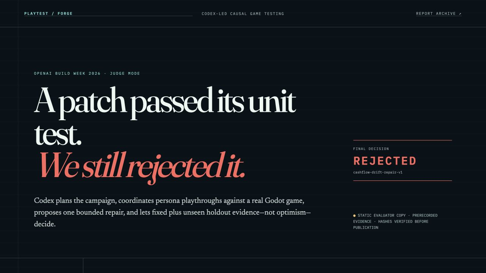
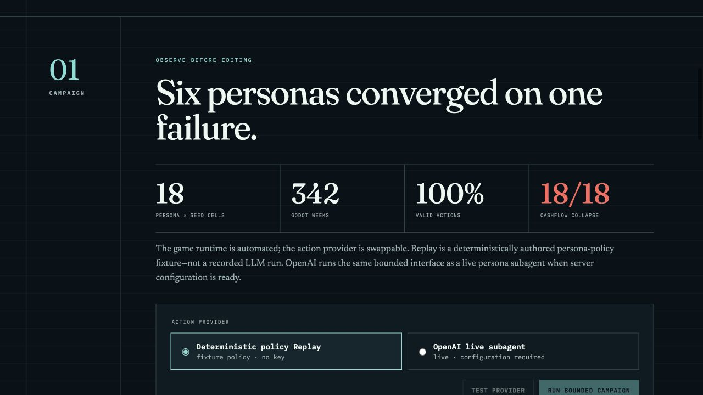
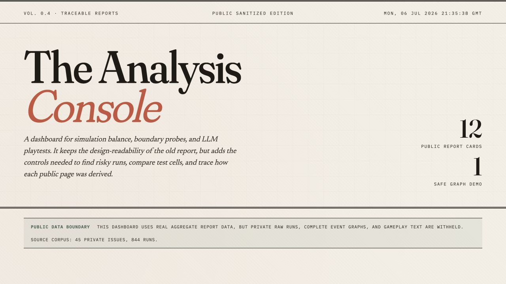
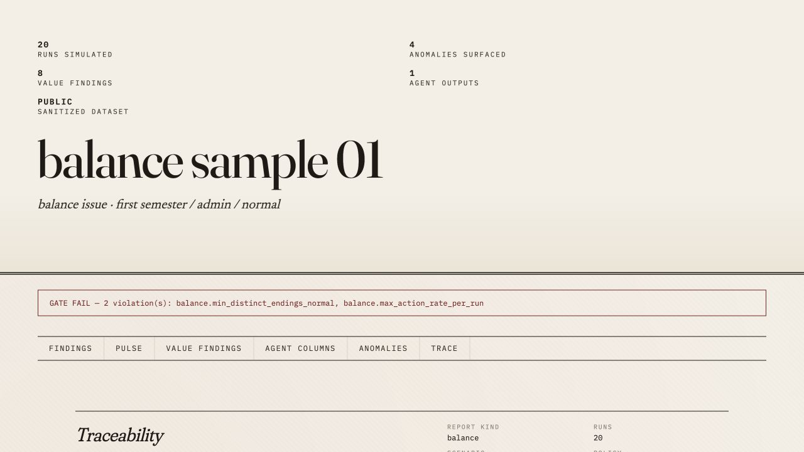
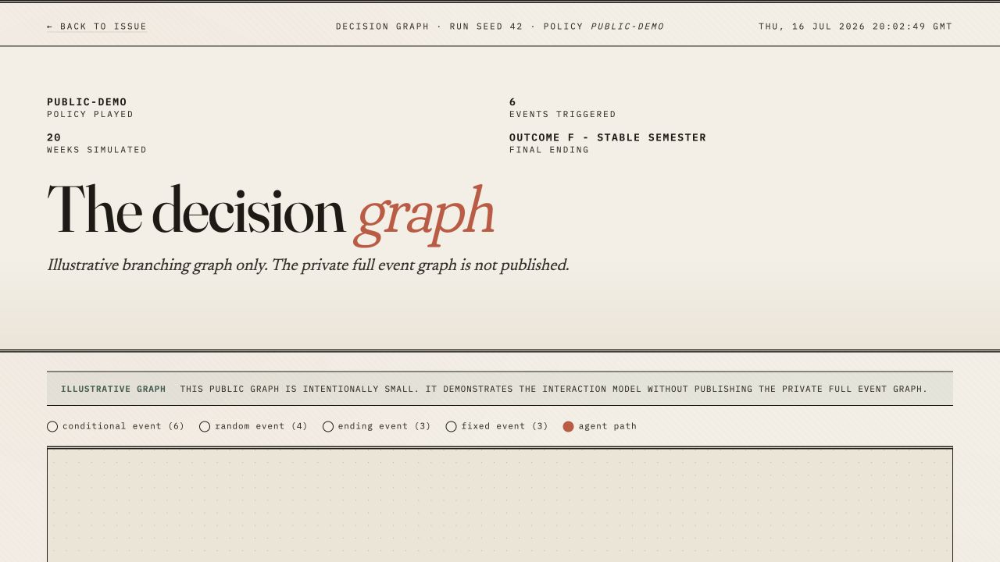
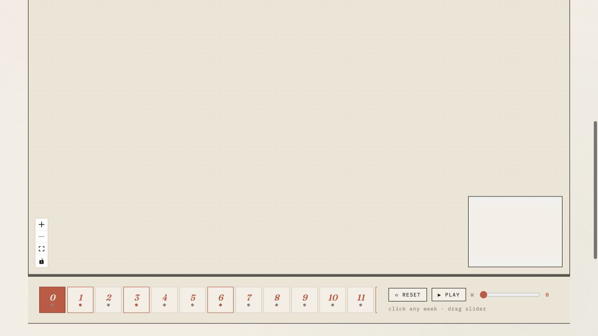
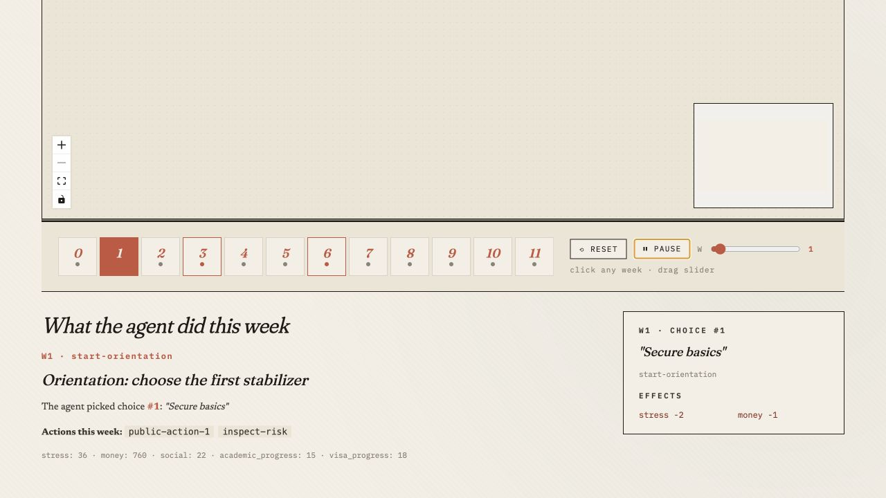

# Playtest Forge 比赛产品设计审计与游戏化前端方案

## 0. 执行结论

当前分支的产品方向是正确的，但距离“让评审眼前一亮”还有一个关键台阶。

最重要的结论有四个：

1. **比赛需要独立体验，但不需要再新建第三个落地页。** 当前 `/` 已经是比赛专用 `JudgePage`，`/reports` 是历史报告档案，这个信息架构是对的。应该把现有 `/` 升级为真正可玩的评审路径，而不是再增加一个营销首页。
2. **当前最大问题不是皮肤不够游戏化，而是核心演示没有形成可操作闭环。** Judge Mode 目前主要是一篇漂亮、可信的证据长页；它能讲清故事，但没有让评审“亲手看到 agent 怎么走、为什么这么走、Codex 为什么拒绝修复”。
3. **Decision Graph 是 P0。** 在本次 1280×720 的 Codex in-app browser 审计中，React Flow 节点被内联渲染为 `visibility:hidden`，边也没有可见输出，画布和 minimap 为空。播放按钮会推进时间轴，下方周详情会更新，但最应成为记忆点的路径图没有出现。
4. **推荐的产品定位不是“给数据后台套游戏皮肤”，而是“Playable Evidence Console”。** 让评审像使用游戏引擎调试器一样，操控 persona 回放、查看状态变化、观察失败吸引子、进入 Codex 修复工坊，再用 fixed/holdout 对局判定 patch 生死。

当前启发式评分：

| 维度 | 当前 | 目标 | 主要差距 |
| --- | ---: | ---: | --- |
| 目标契合度 | 7/10 | 9/10 | 开发者工具定位清楚，但 game developer 的工作对象没有被具象化 |
| 技术可信度呈现 | 8/10 | 9/10 | truth labels、rejected patch 很强；核心证据与交互仍然分离 |
| 完整产品体验 | 6/10 | 9/10 | Campaign → Repair → Proof 是长页，不是可操作工作流 |
| 视觉记忆度 | 6/10 | 9/10 | Hero 很强，但后续缺少角色、运动、状态和可视化高潮 |
| 比赛“眼前一亮” | 5/10 | 9/10 | Decision Graph 空白；静态公开模式的主按钮被禁用 |

## 1. 审计范围与证据边界

### 1.1 本次检查了什么

- 当前分支计划：`README.md`、`IMPLEMENTATION_PLAN.md`、`EXECUTION_PLAN.md`。
- 比赛提交材料：`DEVPOST_DRAFT.md`、`VIDEO_SCRIPT.md`。
- 前端路由与实现：`App.tsx`、`JudgePage.tsx`、`FrontPage.tsx`、`IssuePage.tsx`、`DecisionGraphPage.tsx`、`global.css`。
- 真实浏览器路径：Judge Mode → Campaign → Report archive → Issue detail → Decision Graph → Play。
- 本地验证：离线 Judge Inspect/Replay、15 个前端测试、TypeScript lint、Vite production build。
- 官方比赛标准：[OpenAI Build Week](https://openai.com/build-week/) 与 [Devpost challenge](https://openai.devpost.com/)。

### 1.2 已验证的事实

- `./judge --mode inspect --offline` 通过：123 个工件 hash/schema 和 6 条公开 claim 引用被验证。
- `./judge --mode replay --offline` 通过：6 类 persona、684 个 decision/event 条目、确定性、designed failure 和 rejected repair gate 均通过。
- 前端 15 个测试通过，`tsc --noEmit` 通过，production build 通过。
- production bundle 的主 JS 为 587.41 kB（gzip 184.13 kB），构建给出大于 500 kB 的 code-splitting 警告。
- 当前前端测试 mock 掉了 React Flow，因此能验证文案和路由，却不能证明 graph 节点在真实浏览器中可见。

### 1.3 证据限制

- 本次视觉审计使用 1280×720 桌面视口和公开静态 Replay 数据。
- 没有配置 live OpenAI campaign，因此没有审计真实流式进度、断线、取消和 provider error 状态。
- 没有完成 Chrome、Safari、移动端、屏幕阅读器和完整键盘测试。
- Decision Graph 空白是本次 in-app browser 的可复现结果；修复后仍需在比赛录屏浏览器和至少一个 clean-room 浏览器中复验。
- 截图只能指出可见的可访问性风险，不能据此宣称符合 WCAG。

## 2. 与比赛标准的匹配

Devpost 的公开标准是 Technological Implementation、Design、Potential Impact、Quality of the Idea。Design 明确要求完整、连贯、可运行的产品体验，而不是技术概念验证；Developer Tools 还需要让评审无需重建即可测试。

| 比赛标准 | 当前优势 | 当前风险 | 设计动作 |
| --- | --- | --- | --- |
| Technological Implementation | real Godot、typed evidence、fixed/holdout、Codex 主导 reject | UI 没把因果链和真实运行对象连接起来；graph 空白会让核心技术看起来像静态报告 | 让 persona、事件、state delta、source evidence、patch gate 在同一条可操作路径出现 |
| Design | Judge hero、三阶段叙事、truth labels、非颜色状态都很强 | 长页阅读多、操作少；公开模式主 CTA disabled；从 Judge Mode 跳到 archive 像换了产品 | 把三阶段改为有进度、有状态、有主操作的 evaluator mission |
| Potential Impact | 目标用户和痛点明确：小型游戏团队缺少可重复 playtest 和安全 repair | 看不到日常工作流，无法直觉感受“节省了哪一步” | 用引擎式调试台表达 Run → Inspect → Hypothesize → Verify → Export |
| Quality of the Idea | “系统能拒绝自己的 patch”非常有记忆点 | 目前创新主要靠文字讲；和普通 LLM report dashboard 的视觉差异不够大 | 把 rejected patch 做成可操控、可回放、可比较的核心机制，而不是红色印章之后的一组表格 |

## 3. 四个角色视角的判断

### 3.1 产品设计师视角

**判断：产品主张成立，用户任务尚未被组织成一个真正的工具。**

目标用户是 game developer，不是“阅读项目论文的评审”。他们的核心任务是：

1. 选择一个 build、scenario、persona cohort 和 seed。
2. 运行或回放 playtest。
3. 定位 agent 第一次进入失败状态的时刻。
4. 查看选择、状态差值、日志和证据引用。
5. 让 Codex 给出一个可证伪的 hypothesis 和 bounded patch。
6. 用 fixed 与 holdout 判断 patch 是否可进入人工 review。

现有 Judge Mode 把 1–6 压缩成了三段说明文。它适合展示结论，却不够像日常可复用产品。

产品层面的最大缺口：

- Campaign 只有 4 个数字，没有 persona roster、seed 状态、failure-attractor 入口和代表性 run。
- Repair 没有把“观察事实 / Codex 解释 / hypothesis / source location”做成清楚的因果链。
- Proof 有 cohort 和 gates，但缺少可视化的 baseline/patched 同步回放。
- Judge Mode 没有自然入口进入代表性 Decision Graph；评审需要先去 report archive 才能找到。
- 公开静态模式把 `Test provider` 和 `Run bounded campaign` 禁用，导致第一阶段只有不可用的主操作。

### 3.2 前端设计师视角

**判断：实现基础扎实，但真实浏览器验证和比赛路径编排不足。**

优势：

- 路由已经正确分层：`/` 为 Judge Mode，`/reports` 为 archive。
- Judge API 与 static fallback 的边界清楚，浏览器不接触 API key。
- 状态使用 passed/failed 文本与图标，不仅依赖颜色。
- `prefers-reduced-motion` 已有全局降级规则。
- 页面具有响应式断点和 focus-visible 样式。

主要问题：

- Decision Graph 的自定义节点在本次真实浏览器中保持 `visibility:hidden`，但测试 mock 掉了 React Flow，没有捕获这个回归。
- Graph 的 16 个 event 节点存在于 DOM，manifest 也有完整 `next_event_id`，但可见 edges 为 0，minimap 为空；这是 runtime visual integration failure，不是缺数据。
- timeline week 使用带 `onClick` 的 `div`，不能自然获得键盘、focus 和按钮语义。
- range slider 没有可见或可访问名称；Reset/Play 主要依赖符号前缀。
- 主 bundle 过大；Judge、archive、issue、React Flow 可以按 route lazy-load，减少首次评审加载负担。
- Decision Graph 的 masthead 使用 `new Date()`，显示的是访问时间，不是 artifact/run timestamp，容易削弱证据可信度。
- 浏览器标题仍为 “The Analytical Review”，和 Playtest Forge Judge Mode 不一致。
- `JudgePage`、archive 和 graph 的视觉 token 基本是两套产品；跨路由时缺少统一的 Playtest Forge shell、breadcrumb 和 session context。

### 3.3 UI/UX 设计师视角

**判断：视觉审美明显高于普通 hackathon dashboard，但“游戏感”主要来自配色和字形，不来自交互对象。**

当前做得好的地方：

- Judge hero 在前 10 秒很强：大字号 serif、暗色 evidence ledger、红色 REJECTED、明确的产品反常识。
- archive 的 editorial 风格有辨识度，不像模板化 SaaS dashboard。
- typography 能区分 narrative、data 和 code。
- rejection、limitations、Replay/live truth labels 没有被营销文案掩盖。

当前体验问题：

- 暗色 Judge Mode 与米白 archive/graph 的切换过于突然，像两个独立 demo。
- Hero 的情绪高潮发生得太早，后面没有运动、操作、发现或第二次视觉高潮。
- Campaign 大数字很清楚，但没有“谁失败了、在哪失败、怎么失败”的图像对象。
- Graph 顶部占据大量高度，真正的 canvas 在首屏以下；进入页面时先看声明，后看工具。
- 当前 canvas 空白，即便修复，圆形节点 + 传统 React Flow 也仍然像流程图，不像 agent playthrough。
- 下方已经有周详情和 effect，但它没有被做成 developer console；缺少连续日志、state diff 高亮、evidence ID 和 source link。
- 时间轴只提供 Reset、Play 和 slider，没有用户提出的 Previous/Next step；“step”与“week”的概念也没有分开。
- 多处 9–11px mono 文本在录屏、投影或 100% zoom 下偏小。
- 状态颜色整体可辨，但 archive 的 critical/warning 数字密度很高，需要更明确的分组和空状态。

### 3.4 比赛评审视角

**判断：我会记住“patch 通过单测但仍被拒绝”，但目前不会确信这是一个完成度很高的可用产品。**

评审最可能的心理路径：

- 前 15 秒：主张新颖，rejection 很有记忆点。
- 15–45 秒：数字可信，但静态公开模式的按钮不可用，我开始把它理解为 evidence website。
- 45–90 秒：如果进入 graph 看到空白，核心体验立即失分。
- 90 秒以后：大量技术细节可以证明工程投入，但设计完整度和真实用户工作流仍需要解说才能成立。

最危险的评审问题：

1. “我能不能亲手跑或回放一段，而不是只读预先整理好的结果？”
2. “Codex 的决定到底发生在界面哪一刻？”
3. “Persona 之间的行为差异在哪里？”
4. “这个工具和一份很漂亮的 LLM playtest report 有什么可见差异？”
5. “如果 patch 被拒绝，开发者下一步做什么？”

## 4. 优先级问题清单

### P0 — 不解决就不要录制核心演示

| 编号 | 问题 | 影响 | 验收标准 |
| --- | --- | --- | --- |
| P0.1 | Decision Graph 节点/边不可见 | 核心 demo 失效，直接伤害 Design 和 Implementation | 真实 production build 中节点、边、minimap 可见；Chrome + 比赛录屏浏览器截图通过 |
| P0.2 | 视觉测试 mock React Flow，无法发现真实可见性回归 | 测试全绿但产品坏 | 新增 browser-level smoke：至少断言 1 个 node 可见、1 条 edge 可见、minimap 有内容、Play 后 avatar/step 改变 |
| P0.3 | 公开 static Judge Mode 的主按钮全部 disabled | “way for judges to test”变成只读页面 | static 模式主 CTA 改为 `Play signed replay`，在浏览器本地使用已提交 JSON 执行可视化回放；live CTA 保持明确 unavailable |
| P0.4 | Judge Mode 没有直达代表性 playthrough 的入口 | Campaign 与最有表现力的证据断开 | Campaign 提供唯一主 CTA：`Inspect representative run`，直接进入已选 persona/seed 的 replay inspector |

### P1 — 决定是否有夺冠级表现

| 编号 | 问题 | 推荐 |
| --- | --- | --- |
| P1.1 | 三阶段是文档滚动，不是任务流 | 使用 sticky stage rail 或 stage tabs；每阶段一个主操作、一个可交互主画面 |
| P1.2 | Persona 没有角色化 | 为 6 个 persona 设计真实 avatar/token 资产、目标、风险偏好和当前状态，不使用 emoji 或临时 CSS 图形 |
| P1.3 | Graph 是通用流程图 | 设计 “agent trail”：角色 token 沿已触发路径移动，未走分支弱化，failure attractor 显示危险区 |
| P1.4 | 缺少 Previous/Next 与日志闭环 | 增加 Previous step、Next step、Play/Pause、speed；下方为可折叠 structured log console |
| P1.5 | Proof 缺少直观反事实 | baseline 与 patched 做 split-screen/ghost replay，共用时间轴和量尺，fixed/holdout 是明确切换 |
| P1.6 | 两套视觉系统割裂 | 建立统一 Forge shell；Judge/graph 使用暗色工作台，archive 可保留米白 “printed report” 作为二级阅读模式 |
| P1.7 | OpenAI/Codex 角色只靠文案 | 在事件流中显示 `Persona worker → Godot → Evidence → Codex Repair Director → Gates` 的当前执行节点 |
| P1.8 | 关键说明过于密集 | truth label 固定在顶部 trust bar；正文只保留对当前决策必要的信息，完整 provenance 放 evidence drawer |

### P2 — 比赛前有余力再做

- Route-level lazy loading，优先加载 Judge hero 和 Campaign；进入 graph 时再加载 React Flow/dagre。
- 为视频录制加入 presentation mode：隐藏非必要 nav，锁定 16:9，放大关键数据。
- 把 artifact timestamp、commit、seed、provider 放入 session header，不使用当前系统时间替代。
- 补充 mobile/reflow，但比赛录制和评审主路径优先 desktop 1280/1440。
- 为 accepted repair 设计同结构状态，但不要为了好看伪造一次 accepted 结果。

## 5. 是否单独为比赛新建页面

### 决策

**需要比赛专用体验；当前分支已经建了，所以不要再新建另一个首页。**

推荐路由：

```text
/                                  Competition Judge Mission
  ├─ Campaign                      persona squad + attractor overview
  ├─ Repair                        Codex hypothesis + bounded patch workshop
  └─ Proof                         fixed/holdout arena + final decision

/playthrough/:issue/:run           Playable Replay Inspector
/reports                           Evidence Archive
/issue/:kind/:id                   Printed Report Detail
```

实现上可以继续保持 SPA route，也可以让 Campaign/Repair/Proof 成为 `/` 内的 stage state。关键不是 URL 数量，而是评审始终知道自己在同一个 experiment 中。

不建议新增纯营销落地页，原因：

- 比赛视频不到 3 分钟，评审需要立即看到 working product。
- 当前 hero 已经承担了 thesis 和品牌任务。
- 多一层 landing page 会增加一次无价值点击，并稀释唯一 golden path。
- 真正需要的是一个强 replay inspector，而不是更多介绍性页面。

## 6. 设计理念：Game-tool native，而不是 game-skin

建议采用 **Forge Theater / Playable Evidence Console** 设计语言：

- **Game-world affordance**：persona avatar、地图节点、路径、危险区、ghost run、checkpoint、gate。
- **Developer-tool truth**：seed、commit、provider、state delta、source path、hash、log、diff、test result。
- **Editorial storytelling**：保留当前大标题、rejected stamp 和少量 serif，用于表达关键判断。

三者必须同时存在。只增加霓虹、像素字体、emoji、手柄图标会显得廉价；只保留报表会失去用户群体特征。

### 视觉方向

- 主工作台使用现有深色 `judge-shell`，强化为游戏引擎 debugger，而不是赛博朋克装饰。
- cyan 表示可交互证据和当前路径，amber 表示需要注意/待验证，red 表示 failed gate，green 仅用于 verified pass。
- Persona 头像/runner 使用一套正式生成或委托的 sprite/token 资产；Codex、Godot 标识只使用授权/仓库已有资产。
- Motion 用于解释状态变化，不用于装饰：token 行走、路径点亮、state delta 跳变、gate 结算。
- 必须支持 `prefers-reduced-motion`：token 直接跳到目标节点，路径和日志仍同步更新。

## 7. 目标比赛体验

### 7.1 Stage 0 — Mission Brief

目标：15 秒内回答“这是什么、为什么不一样、我现在能做什么”。

界面：

- 保留 “A patch passed its unit test. We still rejected it.”。
- Verdict 旁增加 experiment context：game、build、provider truth、commit、campaign size。
- 唯一主 CTA：`Play the rejected repair`。
- 次级 CTA：`Run offline judge` 或复制两条命令。
- 顶部 trust bar：`PRERECORDED REPLAY` / `HASH VERIFIED` / `REAL GODOT ROWS`，每项可打开证据抽屉。

### 7.2 Stage 1 — Campaign / Persona Squad

把“18 / 342 / 100% / 18/18”从统计条升级为行为概览：

- 左侧：6 个 persona token，每个显示 intent、3 个 seed 状态、ending 与 first-attractor week。
- 中间：Failure Attractor Map。每条 persona path 从不同起点进入同一 cashflow/stress danger zone。
- 右侧：代表性 run 卡片，显示 seed、week、当前风险、为什么选它。
- 底部主操作：`Inspect representative run`。

这张图要直接证明“不同玩家意图发生了异常收敛”，而不是让评审从 18/18 自己推导。

### 7.3 Stage 2 — Playthrough Inspector

这是全产品的记忆点。

布局建议：

```text
┌ Persona / Seed / Provider / Build / Evidence status ┐
├ Persona roster ┬ Playthrough graph ┬ State inspector ┤
│ intent/status  │ runner + branches │ before / after  │
├───────────────┴───────────────────┴─────────────────┤
│ Prev step | Play/Pause | Next step | Speed | Week     │
├ Structured event log / evidence / source references ┤
└──────────────────────────────────────────────────────┘
```

核心交互：

- Agent/runner 位于当前 triggered event，移动时点亮实际 path。
- `Previous step` / `Next step` 在 triggered steps 间移动；week slider 用于任意周，不混淆 step 与 week。
- Space 播放/暂停，←/→ 上一步/下一步；所有控制有文本 label、focus 和 tooltip。
- 点击未走分支时进入 branch preview，不改变实际 replay；返回当前路径只需一次操作。
- State inspector 显示 `before → after`，只高亮变化项；数值必须有单位和方向。
- 下方日志每行包含 `week / persona / selected action / reason / state delta / evidence id`。
- Replay 与 live 复用同一事件 schema；truth badge 始终可见，不能用相同动画掩盖 provenance 差异。

### 7.4 Stage 3 — Codex Repair Workshop

把 Codex 的独特作用做成可见的工作台：

- 左列 `Observed facts`：每条 fact 可跳回对应 run/week/evidence row。
- 中列 `Codex hypothesis`：一个机制、预测方向、可证伪条件。
- 右列 `Bounded patch`：allowlist、file/line budget、2 files、diff、focused validator。
- `Mechanism Lock` 像开发工具 lock，而不是游戏装饰；明确禁止 prompt/persona/gate/seed 修改。
- REJECTED stamp 保留，但在验证结束前只显示 `CANDIDATE`，避免先泄露结论。

### 7.5 Stage 4 — Proof Arena

目标：让评审一眼看懂“钱变多了，但目标 failure 没有改善”。

- fixed / holdout 两个 tab，默认先 fixed，再揭示 holdout。
- baseline 与 patched 使用相同坐标、同一时间轴和同步 cursor。
- 允许用 ghost runner 或 split-screen 表示两条轨迹；两边共享 scale，不能视觉夸大差异。
- 主目标 `target cluster membership` 始终置顶，money 是 secondary metric。
- Gate scoreboard 逐项结算；失败项先出现，designed failure preserved 是关键安全项。
- 最终动画不是庆祝，而是把 candidate patch 移入 `Rejected experiments`，显示 `not merged` 和下一实验入口。

### 7.6 Stage 5 — Next Experiment

Rejected 不是死胡同。结束页给开发者三个明确动作：

1. Inspect failed causal chain。
2. Start a new bounded hypothesis。
3. Export/share evidence packet。

比赛演示只突出第 1 项，避免看起来像系统失败后没有后续价值。

## 8. 不同场景的游戏化拓展

| 项目场景 | 游戏化表达 | 开发者价值 | 比赛表现 |
| --- | --- | --- | --- |
| Persona campaign | squad/loadout roster，不同 intent 和风险偏好 | 一眼看到 cohort 是否真的不同 | 证明不是同一个 bot 换名字 |
| Decision path | runner/token 沿 graph 行走 | 定位每一步决策与状态变化 | 最直接的视觉记忆点 |
| Failure cluster | attractor/danger zone，显示 first entry | 解释跨 persona 异常收敛 | 把抽象统计变成因果故事 |
| Boundary probe | 地图边界、invalid state hazard、invariant shield | 游戏开发者熟悉的边界调试 | 体现不只是 balance report |
| Content route | fog-of-war route map、unreachable nodes | 发现未触达事件/ending | 展示内容 QA 扩展性 |
| Economy/balance | resource HUD + pressure timeline | 观察钱/压力/恢复窗口 | 适合当前 cashflow case |
| Repair | workbench + mechanism lock + diff | 明确允许改什么、不允许改什么 | 强化 Codex 主导和安全边界 |
| Fixed/holdout proof | ghost run / arena scoreboard | 防止 overfit | 突出产品创新 |
| Evidence/provenance | inventory drawer / evidence cards | hash、commit、seed 可追溯 | 让游戏感不牺牲可信度 |

## 9. 视觉与组件规范

### 9.1 必须新增的核心组件

- `ExperimentHeader`：game/build/provider/commit/truth label。
- `StageRail`：Campaign / Repair / Proof，可见当前阶段和完成状态。
- `PersonaToken`：头像、intent、seed 状态、ending。
- `AttractorMap`：多 persona 路径与 danger zone。
- `ReplayRunner`：当前 actor 与 path transition。
- `StepTransport`：Previous / Play / Next / speed / week。
- `StateDeltaInspector`：before/after 结构化差异。
- `EvidenceConsole`：bounded logs、source/evidence links。
- `MechanismLockCard`：hypothesis、allowlist、budget。
- `GhostComparison`：baseline/patched 同尺度对比。
- `GateScoreboard`：文本、图标、状态和 evidence link。
- `EvidenceDrawer`：完整 provenance 和 reproducibility command。

### 9.2 不要做的事情

- 不用 emoji 代替 persona 美术资产。
- 不用手工 CSS 小人、ASCII art 或随意拼出的 Codex/Godot logo。
- 不把所有边框变成游戏 HUD 装饰，降低数据可读性。
- 不用夸张 animation 掩盖 Replay/static truth label。
- 不把 rejection 设计成“失败页面”；它是安全判断成功。
- 不为了视频伪造 live state、accepted patch 或更好看的 metric。

## 10. 可访问性与输入设计

必须在实现时一起解决：

- timeline cell 改为真实 `button`，使用 `aria-current` 表示当前 step/week。
- range slider 使用 `<label>` 或 `aria-label="Week"`，暴露 min/max/current。
- Graph node 可键盘聚焦，Enter 打开详情；箭头键只在明确规则下移动。
- Play 状态通过按钮名称和 `aria-pressed`/状态文本表达，不只靠图标。
- autoplay 默认关闭；提供 speed 和明确 pause；reduced motion 模式直接跳转。
- 录屏关键文字不小于 14px；辅助 meta 可小，但不能承载唯一信息。
- Canvas 必须有等价的结构化 step list，屏幕阅读器不依赖空间布局。
- Cyan/red/amber 状态继续配合 passed/failed/unavailable 文本。
- 验证 200% zoom、键盘顺序、focus trap、对比度和长文本溢出。

## 11. 前端实现建议

### 11.1 P0 技术修复顺序

1. 在真实 production build 复现 React Flow hidden state。
2. 检查 node measurement、custom node wrapper 尺寸、React Flow 初始化时机和 ResizeObserver；不要用全局 `visibility:visible !important` 掩盖未完成 measurement。
3. 验证 edges 数量、fitView、minimap 与 embedded graph。
4. 新增真实浏览器 smoke，不 mock React Flow。
5. 修复后在相同 1280×720 截图对比，并在视频录制浏览器复验。

### 11.2 静态模式应该“能玩”

static fallback 已经有 `judge-demo.json` 和 public decision graph manifest。浏览器可以在不调用 API 的前提下完成：

- 播放已签名 replay。
- 选择代表性 persona/seed。
- Previous/Next/Play/speed。
- 查看日志、state delta 和 evidence references。
- 浏览 exact candidate diff 和 proof gates。

因此 static 模式不应该把整个 Campaign 主操作禁用。需要禁用的是“新建 live campaign”，不是“体验产品”。

### 11.3 测试矩阵

| 层 | 必须证明 |
| --- | --- |
| Unit | step/week reducer、playback speed、truth label、state delta、gate sort |
| Component | persona selection、Previous/Next 边界、log sync、reduced motion |
| Browser visual smoke | graph node/edge/minimap 可见；runner 移动；static replay 可操作 |
| Accessibility smoke | keyboard path、slider name、button semantics、focus visible |
| Evidence contract | UI 显示的数字、commit、seed、provider 和 decision 与 artifact 一致 |
| Clean-room | public URL 无 key/GPU/Docker 也能完成 signed replay golden path |

### 11.4 性能

- `React.lazy`/dynamic import 分离 Judge、archive、issue 和 React Flow。
- Judge hero 和 campaign summary 不应等待 graph bundle。
- Graph 首次进入显示 skeleton + 明确 load state，不允许空白画布看起来像成功。
- 记录 LCP、graph interactive time 和 1280×720 截图稳定时间。

## 12. 与三分钟视频的重新编排

最终录制以
[`submission/build-week-2026/VIDEO_SCRIPT.md`](../../../../submission/build-week-2026/VIDEO_SCRIPT.md)
为唯一时间轴。当前 2:55 分镜如下；本节只保留产品设计摘要，不再维护另一套旁白：

| 时间 | 画面 | 评审得到的结论 |
| --- | --- | --- |
| 0:00–0:12 | W3 attractor 快切 `REJECTED` | 反常识主张：安全 agent 必须敢于不发布 |
| 0:12–0:28 | 工作 UI 上叠加 Codex → GPT-5.6 → Godot → gates | 产品、受众和完整闭环 |
| 0:28–1:05 | OpenAI Playthrough Inspector；切 persona、W1/W3/W19、choice/state/hash | GPT-5.6 语义选择与真实 Godot 执行可见且可审计 |
| 1:05–1:30 | OpenAI Judge experiment；Campaign 完成而 Repair/Proof pending | live campaign 不被夸大为修复证明 |
| 1:30–1:55 | Codex task facts → hypothesis → frozen limits → bounded diff | Codex 负责因果判断与受限工程决策 |
| 1:55–2:30 | Signed Replay 的 fixed/holdout、失败 gates、`REJECTED` | 局部现金改善不足以证明玩家级问题被修复 |
| 2:30–2:48 | bilingual correctness fixed/holdout 与 `ACCEPTED` | gates 通过时系统也能接受正确修复 |
| 2:48–2:55 | Judge 总览、公开 demo/repo CTA | 以影响和可测试入口清楚结束 |

不要在视频中花时间展示 archive 列表、安装依赖、拉 Docker 镜像或等待 fresh
campaign。Archive 是可信度深度，不是演示主角。录制画面必须持续区分 live OpenAI
campaign、prerecorded Replay repair proof 和 deterministic zero-model proof。

## 13. 截止日前的建议执行计划

### 先完成：比赛可用性包

1. 修复 graph 可见性和真实浏览器测试。
2. static mode 增加可用的 signed replay CTA。
3. Judge Campaign 直达 representative run。
4. 增加 Previous/Next + structured log + state delta。
5. 录制一条 1280/1440 的完整 golden path。

### 再完成：夺冠表现包

1. Persona token 正式资产。
2. Failure Attractor Map。
3. Ghost fixed/holdout comparison。
4. 统一 Forge shell 与 presentation mode。
5. 让 Codex Repair Workshop 中每条事实能跳回 evidence。

### 最后完成：扩展包

- Boundary/content route 场景模板。
- Accepted experiment 状态。
- 移动端和更完整的 accessibility pass。
- 完整 code splitting 与性能预算。

如果时间不足，宁可只把一条 rejected experiment 做到完全可玩，也不要同时铺开多个半成品页面。

## 14. 夺冠级验收标准

比赛提交前，评审应该能够在 90 秒内完成：

1. 从 `/` 理解产品主张和 Replay/live 边界。
2. 点击一个可用 CTA 开始 signed replay。
3. 看见 persona/runner 在 graph 上移动。
4. 使用 Previous/Next 定位一个关键选择。
5. 在同一屏看到 action、state delta、log 和 evidence id。
6. 跳到 Codex hypothesis 与 exact diff。
7. 切换 fixed/holdout，看到目标 failure 没有下降。
8. 理解为什么 patch 被 rejected、为什么这仍是成功结果。
9. 找到 offline judge 命令和完整 provenance。

技术验收：

- 无空白 graph、无 disabled golden-path CTA、无 console error。
- 关键数字全部来自 committed artifact，不由 UI 手写第二份 truth。
- Replay 不被称为 live，OpenAI unavailable 不被渲染成成功。
- Graph、timeline、controls、logs 在比赛录屏浏览器中完成真实截图验证。
- 键盘可完成核心 replay；reduced motion 可完成同一任务。
- public URL 与 clean-room 路径无需 rebuild、GPU 或 API key。

## 15. 审计步骤与截图

### Step 1 — Judge Mode hero：健康度「良好」

主张、层级和 rejected verdict 很强；这是应保留的比赛入口。



### Step 2 — Campaign stage：健康度「需要改进」

数据可信、层级清楚，但公开 static 模式没有可用主操作，也没有 persona/path 视觉证据。



### Step 3 — Report archive：健康度「良好但次要」

editorial identity 有辨识度，适合作为 evidence depth；不应成为比赛 golden path 的主要画面。



### Step 4 — Issue detail：健康度「信息完整、路径偏长」

gate、traceability 和报告结构扎实，但更像 printed report，适合 drill-down，不适合作为首次体验。



### Step 5 — Decision Graph entry：健康度「入口过重」

先显示大面积封面与公开声明，真正的可交互区域在首屏以下；应压缩为 experiment header。



### Step 6 — Decision Graph canvas：健康度「阻塞 / P0」

节点和边没有可见渲染，minimap 为空；这是本次审计最严重的问题。



### Step 7 — Playback controls and log：健康度「部分可用」

Play 能把 slider 从 0 推进到 1，详情与 effect 可读；但 graph 仍为空，缺少 Previous/Next，日志不是连续 console。



## 16. 最终建议

**保留当前比赛专页，重做它的交互主画面，不再新建另一个落地页。**

当前项目最珍贵的不是暗色皮肤、React Flow 或一组大数字，而是这个产品机制：不同 persona 先留下可重复证据，Codex 只做一个 bounded experiment，然后由 fixed/holdout 决定 patch 去留。前端应该让评审亲手操作这条机制。

一句话设计北极星：

> 让游戏开发者像回放一局游戏一样审查 agent，像使用引擎调试器一样定位证据，像看一场公平对局一样判断 patch。
