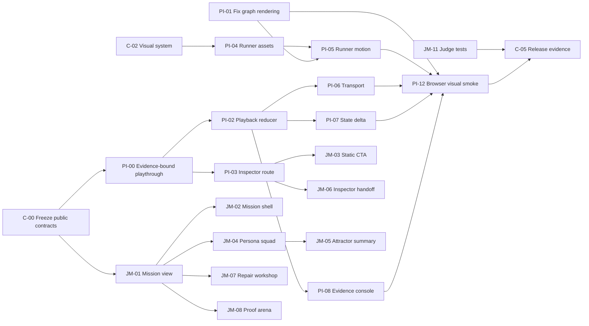

# Judge Mission 与 Playthrough Inspector：页面拆解和任务分配

## 0. 交付目标

这份计划只负责两个比赛核心页面：

1. `/` — **Judge Mission**：在一条连续路径中完成 Mission Brief → Campaign → Repair → Proof。
2. `/playthrough-inspector` — **Playthrough Inspector**：回放一个与仓库内嵌 Demo 和真实 campaign evidence 绑定的代表性 persona/seed 路径。

原有 `/decision-graph/:issue/:run` 在迁移期保留兼容，最终重定向或复用同一个 Inspector。`/reports` 和 `/issue/...` 不在本轮重做范围内。

本轮成功标准：评审无需 API key、GPU、Docker 或 rebuild，能在公开 static 模式中完成一条 90 秒以内的 signed Replay 路径，并理解为什么候选 patch 被拒绝。

视觉方向已选定为 **Tactical Forge Mission Map（option 1）**。移除 Codex/机器人 runner；六个 Q 版 Persona 直接代表六种策略，当前选中的 Persona 自己在实际路径上移动。[`PLAYTHROUGH_EVIDENCE_READINESS_PLAN.md`](PLAYTHROUGH_EVIDENCE_READINESS_PLAN.md) 的 `PF-00`–`PF-05` 已通过；该方向已于 2026-07-17 获得确认并完成正式前端实现。

### 0.1 当前执行状态

- Option 1 已通过 Review Lab 确认；Figma 不再属于当前设计或评审流程。
- `PI-00` 的数据基础已完成：`tools/build_playthrough_views.py`、`tools/verify_playthrough_views.py`、18 个实际 cell view 和 hash manifest 已生成并通过测试。
- `JM-04` / `PI-04` 的六 Persona 角色方向和 idle/hover/selected/walk/detail 状态已进入正式 Judge Mission 与 Inspector 交互。
- 正式实现位于 `frontend/src/components/competition/`、`frontend/src/pages/PlaythroughInspectorPage.tsx` 与 `frontend/src/styles/competition.css`。
- 当前比赛演示固定使用已验证的代表性 `money-seed-42` cell；前端从 authoritative `playthrough-v1` JSON 导入事实，不在 JSX 中维护第二份数据真相。
- 构建、17 项前端测试、桌面/平板/移动端浏览器回归、键盘交互及 source-versus-implementation 视觉对照均已通过；记录见 `frontend/design-qa.md`。

## 1. 不可妥协的产品与证据约束

- Replay 必须显示为 `prerecorded` / `deterministic persona-policy fixture`，不能称为 recorded LLM 或 live OpenAI run。
- Static 与 live 共用交互模型，但必须保留可见、持续的 truth label。
- 所有 Campaign 数字、persona/seed、attractor week、gate、patch 和 cohort 比较都必须从生成的 typed public view 读取，不在 JSX 中手写第二份 truth。
- 当前公开 Decision Graph 来自 `tools/build_public_demo.py::_mock_decision_graph()`，它是 illustrative stable-semester path，不能作为比赛 cashflow/stress attractor 的代表性回放。
- 新 Playthrough 必须联合 committed campaign artifacts、hash-pinned Replay fixture 和 `demo/study-in-germany` 的实际游戏内容生成，并绑定 `cell_id`、persona、seed、week、artifact path、line number、record/entry fingerprint 与实际 content source path。
- `persona_runs.jsonl` 只有周级 state truth，不含 event/action/choice；这些行为不得从 state 猜测，必须从 `fixtures/persona_replay/build_week_2026_full_v1.json` 的 exact persona/seed/week entries 关联。
- 事件名、事件正文、行动、选项、状态值、结果和 ending 使用仓库中的实际数据，不脱敏、不改写、不用“更戏剧化”的替代文案，也不再生成 sanitized game-data bundle。
- 数据直接展示不等于暴露运行环境：API key/secret、canonical host path、原始 provider 私有 trace 和未纳入比赛证据契约的内部元数据仍不得进入前端。
- UI 不改变 persona、seed、gate、threshold、evidence 或 rejected decision。
- Rejected candidate 必须持续显示 `candidate_not_merged`。

## 2. 团队角色与文件所有权

| 角色代号 | 角色 | 主要责任 | 独占文件/目录 |
| --- | --- | --- | --- |
| `PD` | Product/UX Lead | 用户路径、信息架构、copy、scope、验收 | 本计划、组件 spec、copy deck |
| `VD` | Visual/Interaction Designer | persona 资产、runner、motion、状态视觉 | `frontend/src/assets/playtest/`、视觉资产说明 |
| `FE-J` | Judge Mission Frontend | Judge 页面、stage state、Campaign/Repair/Proof | `frontend/src/features/judge-mission/`、`JudgePage.tsx` |
| `FE-P` | Playthrough Frontend | graph、playback reducer、controls、inspector | `frontend/src/features/playthrough/`、`DecisionGraphPage.tsx` |
| `DE` | Data/Evidence Engineer | public view builder、schema、API projection、hash binding | `tools/build_judge_frontend_demo.py`、新 public view builder、共享 types 第一版 |
| `QA` | QA/Accessibility | browser smoke、keyboard、visual evidence、regression | 新 browser tests、a11y tests、截图证据 |
| `RE` | Release/Evidence Owner | claim ledger、Judge gates、video path、final truth audit | release checklist、review JSON、demo capture |

### 2.1 小团队合并建议

如果只有 3 人：

- A：`PD + VD + RE`
- B：`FE-J + QA(Judge)`
- C：`DE + FE-P + QA(Inspector)`

如果只有 2 人：

- A：`PD + VD + FE-J + RE`
- B：`DE + FE-P + QA`

不要让两个人同时修改 `frontend/src/types.ts` 或 `global.css`。第一波由 `DE` 冻结 types；样式拆成两个 feature stylesheet 后再并行。

## 3. 目标信息架构

```text
Judge Mission /
  Mission Brief
  ├─ truth bar
  ├─ thesis + rejected verdict
  └─ primary CTA: Play signed replay
  Campaign
  ├─ persona squad (6 × 3 seeds)
  ├─ attractor convergence
  └─ representative playthrough handoff
  Repair
  ├─ observed facts
  ├─ Codex hypothesis + mechanism lock
  └─ exact bounded diff
  Proof
  ├─ fixed / holdout comparison
  ├─ protected gates
  └─ rejected / not merged / next experiment

Playthrough Inspector /playthrough/:campaign/:cell
  Experiment header
  ├─ persona / seed / provider / source / commit
  ├─ truth label / evidence fingerprint
  └─ back to Mission
  Workbench
  ├─ persona roster
  ├─ graph + runner + attractor zone
  └─ state-delta inspector
  Transport
  ├─ previous step / play-pause / next step
  ├─ speed / week scrubber
  └─ keyboard shortcuts
  Evidence console
  ├─ event / action / choice / outcome
  ├─ state delta
  └─ artifact / line / record hash
```

## 4. 共享数据契约

### 4.1 `JudgeMissionView`

由 Python builder 从已验证 artifacts 生成，static frontend 与 Judge API 使用同一形状。

```ts
interface JudgeMissionView {
  schema_version: "judge-mission-view-v1";
  mission_id: string;
  truth: {
    mode: "prerecorded" | "live";
    authoring: string;
    source_revision: string;
    campaign_fingerprint: string;
    design_contract_fingerprint: string;
  };
  campaign: {
    campaign_id: string;
    completed_cells: number;
    total_weeks: number;
    valid_rate: number;
    fallback_rate: number;
    provider_error_rate: number;
    personas: PersonaMissionSummary[];
    target_cluster: AttractorSummary;
    representative_playthrough: PlaythroughLink;
  };
  experiment: JudgeExperiment;
  reproducibility: {
    inspect_command: string;
    replay_command: string;
  };
}
```

### 4.2 `PlaythroughView`

```ts
interface PlaythroughView {
  schema_version: "playthrough-view-v1";
  playthrough_id: string;
  session: {
    campaign_id: string;
    cell_id: string;
    game_project_path: "demo/study-in-germany";
    persona: string;
    seed: number;
    provider: string;
    mode: "prerecorded" | "live";
    source_revision: string;
    max_weeks: number;
    ending_id: string;
  };
  graph: {
    nodes: PlaythroughNode[];
    edges: PlaythroughEdge[];
    target_cluster_id: string;
  };
  steps: PlaythroughStep[];
}

interface PlaythroughStep {
  step_index: number;
  week: number;
  event_id: string;
  event_label: string;
  event_text?: string;
  event_source_path: string;
  selected_action_ids: string[];
  selected_action_labels: string[];
  selected_choice_id?: string;
  choice_label?: string;
  choice_source_path?: string;
  before_state: Record<string, number | string | boolean | null>;
  after_state: Record<string, number | string | boolean | null>;
  delta: Record<string, number | string>;
  target_cluster_entry: boolean;
  sources: {
    state_row: {
      artifact_path: "examples/build_week_2026/campaign-v1/persona_runs.jsonl";
      line_number: number;
      record_sha256: string;
    };
    replay_entries: Array<{
      artifact_path: "fixtures/persona_replay/build_week_2026_full_v1.json";
      entry_id: string;
      fingerprint: string;
    }>;
    game_content: Array<{
      artifact_path: string;
      content_id: string;
    }>;
  };
}
```

### 4.3 Contract rules

- 实际展示数据使用三源关联：`persona_runs.jsonl` 提供 money/stress/ending 等周级 state truth，Replay fixture 提供 selected action 与 event choice，`demo/study-in-germany/data/` 提供实际名称、正文、effects、conditions 与 ending 内容。
- `before_state` 由同一 cell 的上一条 retained row 推导；首条使用 campaign initial state 或明确为 unavailable。
- `delta` 在 builder 中确定性生成并测试，不在 UI 中各自重算。
- `target_cluster_entry` 必须引用 failure-cluster member row，不能由 CSS threshold 自行推测。
- Artifact 与 content source path 使用精确的 repo-relative path；不替换为假路径，也不输出 canonical host path。
- `event_label`、`event_text`、`selected_action_labels`、`choice_label` 必须直接取自仓库内嵌 Demo；找不到源内容时显示 typed unavailable，不自行补写。
- Public view 是实际数据的 typed projection，不是脱敏副本；builder 只做字段关联、delta 计算、来源绑定和 schema 验证。
- Builder 失败、缺 row、hash mismatch 或 incomplete cell 时不得生成 passing fixture。

## 5. Judge Mission 页面拆解

### 5.1 页面状态模型

| 状态 | 触发 | 必须呈现 | 主操作 |
| --- | --- | --- | --- |
| `loading` | view 未完成验证 | skeleton + “verifying evidence” | 无 |
| `static-ready` | API 不可用但 public view 合法 | prerecorded truth bar + signed Replay | Play signed replay |
| `api-replay-ready` | API 与 Replay 可用 | API connected + Replay | Run bounded Replay |
| `live-unavailable` | key/runtime/live runner 缺失 | typed unavailable + remediation | Use signed Replay |
| `live-ready` | server truth 全部 ready | live badge + cost/limit summary | Run bounded live campaign |
| `running` | campaign job active | cells/weeks/status/events/cancel | Cancel |
| `partial/failed` | provider、cell、schema 或 runtime failure | 明确失败，禁止自动 fallback success | Inspect error / Use Replay |
| `completed` | campaign terminal complete | Campaign evidence + inspect representative run | Inspect run |

### 5.2 组件树

```text
JudgeMissionPage
  MissionHeader
    PlaytestForgeWordmark
    TruthBar
    EvidenceDrawerTrigger
  MissionBrief
    Thesis
    VerdictCard
    PrimaryMissionAction
  StageRail
  CampaignStage
    CampaignMetrics
    PersonaSquad
      PersonaCard × 6
      SeedStatus × 3
    AttractorSummary
    RepresentativeRunCard
  RepairStage
    ObservedFactsList
    HypothesisCard
    MechanismLock
    PatchSummary
    ExactDiffDisclosure
  ProofStage
    CohortTabs
    CohortComparison
    GateScoreboard
    FinalDisposition
    NextExperimentAction
  EvidenceDrawer
  ReproducibilityPanel
```

### 5.3 Judge Mission 任务表

| ID | P | Owner | 任务 | 主要文件 | 估算 | 依赖 | Definition of Done |
| --- | --- | --- | --- | --- | ---: | --- | --- |
| `JM-00` | P0 | PD | 冻结 90 秒 golden path、stage 顺序、copy 与唯一主 CTA | 本文、copy deck | 0.5d | 无 | 评审从 Hero 到 Inspector 不超过 2 次点击；每阶段只有 1 个主操作 |
| `JM-01` | P0 | DE | 生成 typed `JudgeMissionView`，替换 JSX 手写 18/342/100%/18/18 | builder、`frontend/public-demo/judge-mission.json`、types | 1d | `C-00` | 数字和 persona/seed/cluster 全部来自 committed verified artifacts；fixture hash/gate 更新 |
| `JM-02` | P0 | FE-J | 创建 feature 目录、Mission shell、TruthBar、StageRail | `features/judge-mission/`、`JudgePage.tsx` | 0.75d | `JM-00`, `JM-01` | `/` 保持现有 hero identity；stage rail 可键盘访问并显示当前位置 |
| `JM-03` | P0 | FE-J | Static-ready 主 CTA：`Play signed replay`，不再因无 API 禁用 golden path | state hook、CTA、router | 0.5d | `JM-01`, `PI-00` | GitHub Pages/static build 能进入 representative Playthrough；live unavailable 仍 fail closed |
| `JM-04` | P1 | FE-J + VD | PersonaSquad：6 个策略 Q 版角色、hover 摘要、click detail、3-seed 表现 | Campaign components、mission CSS、Persona assets | 1.25d | `JM-01`, `C-02`, `PF-04` | Hover 只显示配置或实测字段；click 显示策略契约、3 seeds、实际行动分布与路径入口；slacker 明确 failure-seeking |
| `JM-05` | P1 | FE-J + VD | AttractorSummary：不同 persona 路径收敛到同一 target cluster | Attractor component | 0.75d | `JM-01`, `JM-04` | 视觉结论与 18 members/cluster rule 一致；不暗示 path 是 live animation |
| `JM-06` | P0 | FE-J + FE-P | RepresentativeRunCard 与 Inspector handoff | Campaign stage、routes | 0.5d | `PI-00`, `PI-01` | CTA 带入真实 `campaign_id/cell_id/persona/seed`；Back 返回当前 Mission stage |
| `JM-07` | P1 | FE-J | Repair Workshop：facts / hypothesis / mechanism lock / patch | Repair components | 1d | `JM-01` | fact 在 hypothesis 之前；exact diff、allowlist、not merged 都可见；不新增推断性 claim |
| `JM-08` | P1 | FE-J + VD | Proof Arena：fixed/holdout tabs、同尺度 cohort comparison、gates | Proof components | 1d | `JM-01`, `C-02` | target cluster 是 primary metric；cash 是 secondary；8 gates 完整且非颜色编码 |
| `JM-09` | P1 | FE-J + DE | EvidenceDrawer + reproducibility command | drawer、mission view | 0.5d | `JM-01` | commit/fingerprint/commands 可复制；无 secret/raw prompt/private path |
| `JM-10` | P1 | FE-J + DE | API campaign events 与 static replay 状态统一 | API hooks、campaign reducer | 0.75d | `JM-03` | API running/partial/failed/completed 不与 static-ready 混淆；provider error 不自动变成功 Replay |
| `JM-11` | P1 | QA | Judge component、state、keyboard 与 browser tests | Judge tests | 0.75d | `JM-02`–`JM-10` | 覆盖 static、API replay、live unavailable、failed/partial；主 CTA 可用且 truth label 正确 |
| `JM-12` | P2 | FE-J + RE | 16:9 presentation mode | route/query flag、CSS | 0.5d | `JM-11` | 1280×720 不裁切 primary data；不隐藏 truth label |

## 6. Playthrough Inspector 页面拆解

### 6.1 播放状态模型

```ts
type PlaybackStatus = "idle" | "playing" | "paused" | "ended";

interface PlaybackState {
  status: PlaybackStatus;
  selectedStepIndex: number;
  selectedWeek: number;
  selectedNodeId: string | null;
  branchPreviewNodeId: string | null;
  speed: 0.5 | 1 | 2;
  followRunner: boolean;
}
```

规则：

- Previous/Next 在 `steps` 之间移动，不在空 week 间移动。
- Week scrubber 可以选择任意周；没有 step 的 week 显示最近已完成状态和 “no event triggered”。
- 播放只推进 step，不能因为 sparse weeks 假装发生了事件。
- 点击未走分支只进入 preview，不改变 selected replay path。
- 离开页面或 reduced-motion 切换时停止 timer。
- `ended` 后 Play 文案变为 Replay；Reset 回到 step 0。

### 6.2 组件树

```text
PlaythroughInspectorPage
  PlaythroughHeader
    BackToMission
    PersonaSeedIdentity
    ProviderTruthBadge
    SourceFingerprint
  PlaythroughWorkbench
    PersonaRail
    GraphViewport
      PlaythroughGraph
      RunnerToken
      AttractorZone
      GraphControls
    StateDeltaInspector
  StepTransport
    PreviousStep
    PlayPause
    NextStep
    SpeedControl
    WeekScrubber
  EvidenceConsole
    LogFilter
    StepLogRows
    EvidenceReference
  AccessibleStepList
```

### 6.3 Playthrough Inspector 任务表

| ID | P | Owner | 任务 | 主要文件 | 估算 | 依赖 | Definition of Done |
| --- | --- | --- | --- | --- | ---: | --- | --- |
| `PI-00` | P0 | DE | 在 fresh real-Godot trace 上建立 raw step + Replay entry + 内嵌 Demo content join，替换 illustrative `_mock_decision_graph()` | 新 builder、actual path views、schema tests | 1.5d | `C-00`, `PF-06` | before/after、合法集合、结果、路径边、row/entry/content hash 全部来自通过 gate 的实际 trace；缺 join 即 fail |
| `PI-01` | P0 | FE-P | 修复 React Flow 节点 `visibility:hidden`、边和 minimap 空白 | graph layout/render | 0.75d | 无 | production build 中 ≥1 node、≥1 path edge、minimap 可见；embedded 与 full route 都通过 |
| `PI-02` | P0 | FE-P | 抽出纯 `playbackReducer` 与 selectors | playback state/hooks/tests | 0.75d | `PI-00` | Previous/Next/Play/Pause/Reset/0.5×/1×/2× 可单测；边界无越界 timer |
| `PI-03` | P0 | FE-P | 建立 `/playthrough/:campaign/:cell`，兼容旧 decision-graph route | routes、page adapter | 0.5d | `PI-00`, `PI-02` | 两个入口使用同一 Inspector；旧 public links 不 404；新 route 使用 campaign identity |
| `PI-04` | P1 | VD | 设计 6 个策略 Persona token 与 runner states；交付正式资产 | `assets/playtest/personas/` | 1d | `C-02` | 无 Codex/机器人；非 emoji、非 CSS 小人；每个角色对应明确策略；16/24/40px、hover、selected、reduced-motion 静态态齐全 |
| `PI-05` | P1 | FE-P + VD | 当前 Persona 沿 actual path 移动，路径随 step 点亮 | GraphViewport、motion CSS | 1d | `PI-01`, `PI-02`, `PI-04`, `PF-06` | runner 与当前 persona/seed 一致；step 改变时到正确实际 node；未走分支只在 legal preview 数据存在时显示；reduced motion 直接跳转 |
| `PI-06` | P0 | FE-P | StepTransport：Previous/Play/Next/speed/week，替换 clickable div timeline | transport components | 0.75d | `PI-02` | 所有控件为语义 button/input；Space、←、→ 可用；slider 有 label/min/max/current |
| `PI-07` | P0 | FE-P | StateDeltaInspector：before/after/delta、单位、正负方向 | state components | 0.75d | `PI-00`, `PI-02` | 只突出变化字段；无变化明确；money/stress 等方向不靠颜色单独表达 |
| `PI-08` | P0 | DE + FE-P | Structured Evidence Console：step log 与 evidence reference | fixture、console components | 1d | `PI-00`, `PI-02` | 每行含实际 event/action/choice/state delta、week/persona/evidence id/content source；hash 可复制；不输出 secret、host path 或 provider 私有 trace |
| `PI-09` | P1 | FE-P | Branch preview 与 Return to actual path | graph interaction | 0.5d | `PI-01`, `PI-02` | preview 不修改 replay state；actual/available branch 有文本和线型区分 |
| `PI-10` | P1 | FE-P | PlaythroughHeader 与 Mission context continuity | header、breadcrumbs | 0.5d | `PI-03` | 显示 persona/seed/provider/mode/source revision；不使用访问时间伪装 artifact timestamp |
| `PI-11` | P1 | FE-P + QA | AccessibleStepList、focus、reduced motion、200% zoom | a11y components/tests | 0.75d | `PI-06`–`PI-10` | 不依赖 canvas 也可理解全部 step；键盘可完成核心任务；focus 不丢失 |
| `PI-12` | P0 | QA | 真实 browser visual smoke，不 mock React Flow | browser tests、截图 | 1d | `PI-01`, `PI-05`–`PI-08` | 断言 node/edge/minimap/runner 可见；Next 后 state/log/evidence 同步；空白 canvas 测试失败 |
| `PI-13` | P2 | FE-P | Route-level lazy load React Flow/dagre | `App.tsx`、lazy boundary | 0.5d | `PI-03`, `PI-12` | Judge 首屏不加载 graph chunk；Inspector load 有明确 skeleton/error state |

## 7. 跨页面任务

| ID | P | Owner | 任务 | 估算 | Definition of Done |
| --- | --- | --- | --- | ---: | --- |
| `C-00` | P0 | DE + PD + QA | 冻结两个 public view schema、实际游戏字段映射、source binding、representative cell 选择规则与安全排除项 | 0.5d | schema、游戏内容来源、campaign row/hash、truth label、failure semantics 有测试和书面记录；实际游戏字段无脱敏层 |
| `C-01` | P0 | FE-J + FE-P | 拆分 feature styles，避免并行修改 `global.css` | 0.25d | `judge-mission.css` 与 `playthrough-inspector.css` 独立；共享 token 只在一处 |
| `C-02` | P1 | VD + PD | 冻结 Forge visual tokens、asset slots、motion/reduced-motion rules | 0.5d | 延续现有 dark Judge identity；archive editorial identity 不在本轮重做 |
| `C-03` | P1 | FE-J + FE-P | 共享 `TruthBadge`、`EvidenceRef`、`StatusText`、`CopyButton` | 0.5d | 两页面相同 truth 不出现不同文案或颜色语义 |
| `C-04` | P0 | QA + RE | Competition golden-path test contract | 0.5d | 1280×720、1440×900、keyboard、reduced motion、static/no-key、API replay 全部定义 |
| `C-05` | P1 | RE + DE | 更新 Judge manifest/claim ledger/release review，只引用新生成 artifacts | 0.5d | Inspect/Replay hash pass；UI 截图不替代 execution proof |

## 8. 依赖关系与并行波次



### Wave 0 — Truth and unblock（半天）

- `C-00`, `C-01`, `C-04`
- `PI-01` 可与 contract 工作并行，优先修 graph blank。
- 产物：冻结 schema、file ownership、browser DoD、可见 graph。

### Wave 1 — Evidence spine（1 天）

- `JM-01`：Mission public view。
- `PI-00`：真实 evidence-bound representative playthrough。
- `PI-02`, `PI-03` 在 fixture 第一版后启动。
- `C-02`, `PI-04` 由设计并行。
- 产物：两个页面都不再依赖 hardcoded JSX 或 illustrative mock。

### Wave 2 — Core interaction（1–1.5 天）

- Judge lane：`JM-02`, `JM-03`, `JM-04`, `JM-06`, `JM-07`, `JM-08`。
- Inspector lane：`PI-05`, `PI-06`, `PI-07`, `PI-08`, `PI-10`。
- QA 先写 failure-first browser assertions，不等所有 polish。
- 产物：完整 90 秒 static golden path。

### Wave 3 — Proof and polish（1 天）

- `JM-05`, `JM-09`, `JM-10`, `JM-11`。
- `PI-09`, `PI-11`, `PI-12`。
- `C-03`, `C-05`。
- 产物：真实浏览器、keyboard、reduced motion、Judge gates 和 release evidence 通过。

### Wave 4 — Only if green（半天）

- `JM-12` presentation mode。
- `PI-13` lazy loading。
- 视频录制与 final screenshots。

## 9. 每日同步与交接格式

每个任务完成时交付五项：

1. Task ID 与 commit/patch。
2. 修改文件列表。
3. 测试命令与结果。
4. 对应 1280×720 截图或 terminal evidence。
5. 未解决风险和下一个可启动任务。

禁止用“页面完成”代替具体验收。任务只有在 Definition of Done 全部满足时才从 `in review` 进入 `done`。

## 10. 测试与验收矩阵

| Gate | Judge Mission | Playthrough Inspector | Owner |
| --- | --- | --- | --- |
| Offline truth | Mission view hash/schema/claim refs | playthrough row/hash/cluster entry | DE + RE |
| Static no-key | signed Replay CTA 可用 | 完整 Previous/Next/Play/log | FE + QA |
| API Replay | running/completed events 正确 | handoff identity 不变 | FE-J + DE |
| Live unavailable | typed unavailable，不 fallback success | truth badge 不变成 live | FE-J + QA |
| Browser visual | hero/stage/CTA 不裁切 | node/edge/minimap/runner 可见 | QA |
| Keyboard | stage rail、CTA、drawer | transport、step list、branch preview | QA |
| Reduced motion | 无装饰性强制 motion | runner jump、log/state 同步 | QA |
| Evidence boundary | 实际游戏数据原样展示；无 secret/host path/provider 私有 trace | repo-relative game source + evidence ref + row hash | DE + RE |
| Repair truth | facts before hypothesis、not merged | 只展示真实 observed steps | Playtest Forge review |
| Release | Inspect/Replay pass | browser proof 附加而非替代 evaluator | RE |

### 10.1 必跑命令

```bash
./judge --mode inspect --offline --json --output-dir -
./judge --mode replay --offline --json --output-dir -

cd frontend
npm test
npm run lint
npm run build:public
```

新增 browser suite 后必须提供独立命令，并在无 API server 的 static build 上至少跑一次。

## 11. Scope cuts

如果进度落后，按此顺序删减：

1. 删 presentation mode (`JM-12`)。
2. 删 branch preview (`PI-09`)；保留 actual path。
3. 简化 AttractorSummary 动画；保留 persona/seed/entry week 的静态可视化。
4. Proof Arena 不做复杂 ghost animation；保留 fixed/holdout 同尺度切换和 gate scoreboard。
5. Persona 可先使用一套正式 token 资产，不做每人完整 sprite animation。

不可删减：`JM-01`, `JM-03`, `JM-06`, `PI-00`, `PI-01`, `PI-02`, `PI-06`, `PI-07`, `PI-08`, `PI-12`, `C-00`, `C-04`。

## 12. 两页面 Definition of Done

### Judge Mission 完成条件

- `/` 的唯一 primary CTA 在 static 模式可用。
- Campaign、Repair、Proof 仍保持一条连续 experiment context。
- 18 cells、342 weeks、100% valid、18/18 target members 来自 typed mission view。
- 6 persona × 3 seeds 可见，slacker 的 designed-failure intent 表达正确。
- Representative playthrough 直达 evidence-bound Inspector。
- Repair facts 在 hypothesis 之前；patch 为 candidate、not merged。
- Fixed 与 holdout 使用相同 metric scale；目标 failure 没改善时明确 rejected。
- Offline commands、truth labels、fingerprints 可访问且无 secret。
- Static、API Replay、live unavailable、failed/partial 状态均有测试。

### Playthrough Inspector 完成条件

- Graph node、actual path edge、minimap、runner 在 production browser 可见。
- 当前 playthrough 与真实 campaign cell/seed/cluster member/hash 绑定，不再使用 illustrative stable-semester mock。
- Event、event text、action、choice、state 与 ending 直接来自 `demo/study-in-germany` 和 committed campaign rows，无脱敏或替代文案。
- Previous、Next、Play/Pause、Reset、speed、week scrubber 均可用。
- Step、week、branch preview 三个概念不混淆。
- State delta 与 evidence console 随 step 原子同步。
- 每一步可回溯 artifact path、line 和 record hash。
- Replay/live truth label 始终可见且准确。
- Canvas 有 accessible step-list 等价表示。
- Keyboard、reduced motion、200% zoom 通过。
- 真实 browser test 能让空白 canvas、runner 不动或 log 不同步时失败。

## 13. 第一批任务领取顺序

无需等待全部设计稿，第一批可以立即领取：

1. `DE`：`C-00` → `PI-00` 与 `JM-01`。
2. `FE-P`：`PI-01` → 等待 fixture 接口后 `PI-02`。
3. `FE-J`：`C-01` → `JM-02` shell 骨架，但 metrics 接口等待 `JM-01`。
4. `PD + VD`：`JM-00` + `C-02` + `PI-04` asset spec。
5. `QA`：`C-04`，先写 graph-visible 与 static-CTA failure assertions。
6. `RE`：准备 `C-05` 的 claim/evidence checklist，但在新 artifacts 生成前不更新 passing 结论。

## 14. Playtest Forge 评审顺序

页面实施完毕后的比赛证据叙事必须保持：

> test contract → cited facts → interpretation → one hypothesis → bounded diff → focused test → fixed proof → holdout proof → protected gates → rejected decision → next experiment

来源标签：

- Campaign state truth 与 gates：automation / committed artifacts。
- Persona behavior：prerecorded deterministic persona-policy Replay。
- 本轮没有 fresh live OpenAI evidence时，UI 不得显示 live completed。
- Focused validator 只证明 implementation legality，不证明 player-level repair。
- Fixed 与 holdout target 都未改善，因此当前决定仍是 `rejected`。
