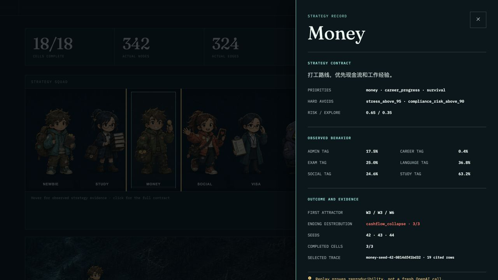
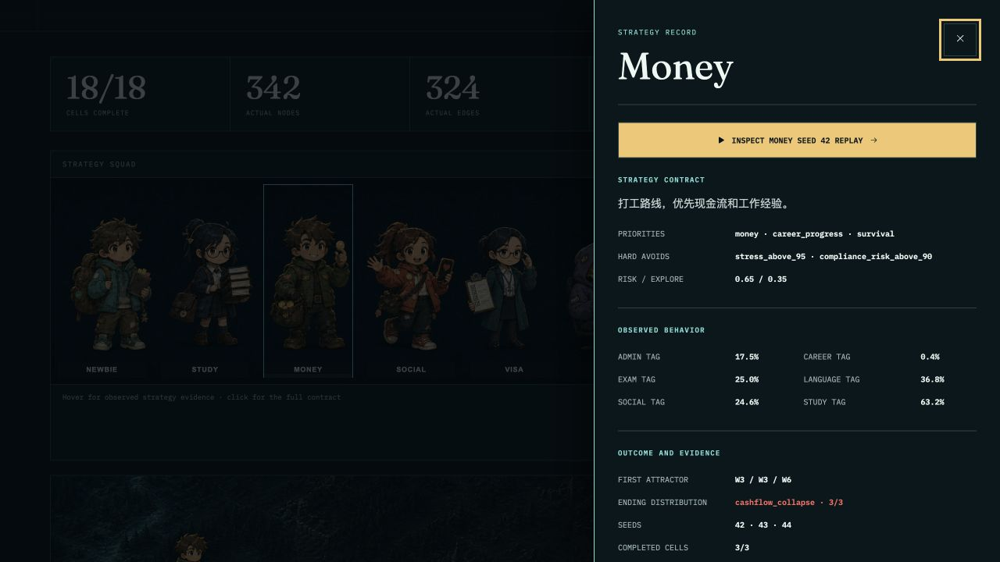
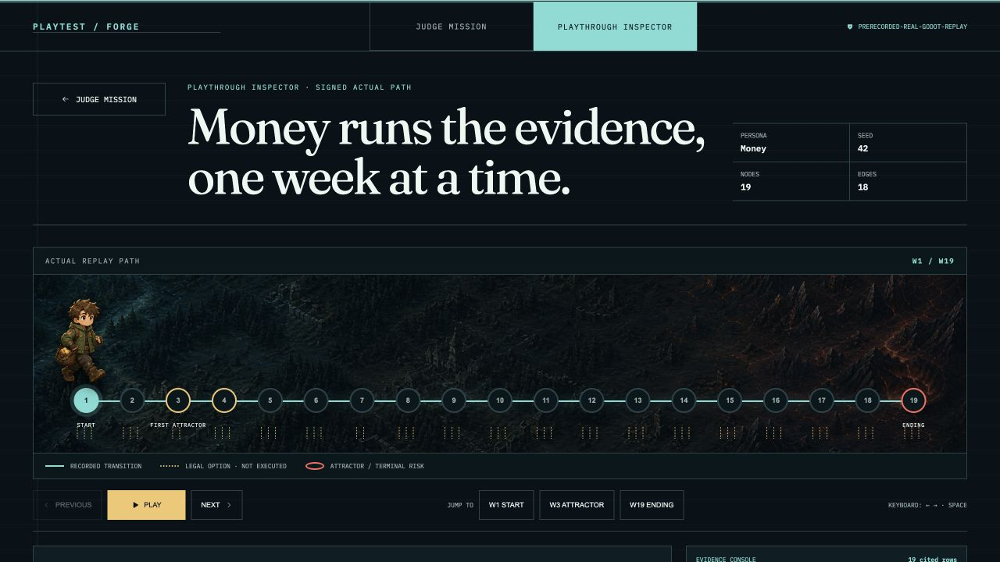
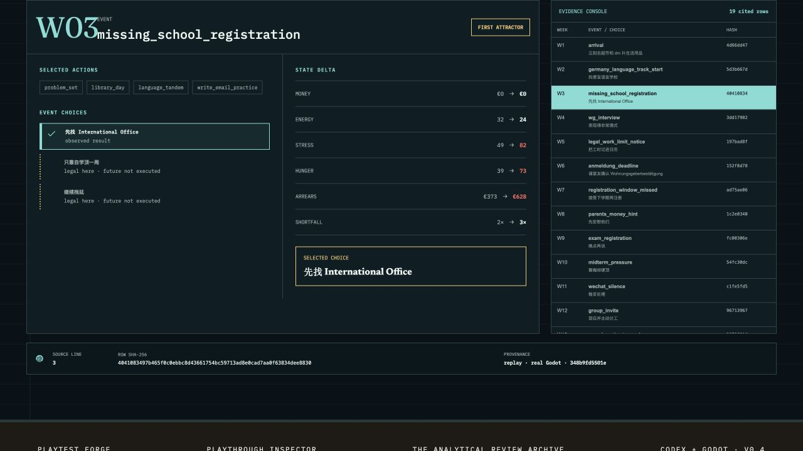
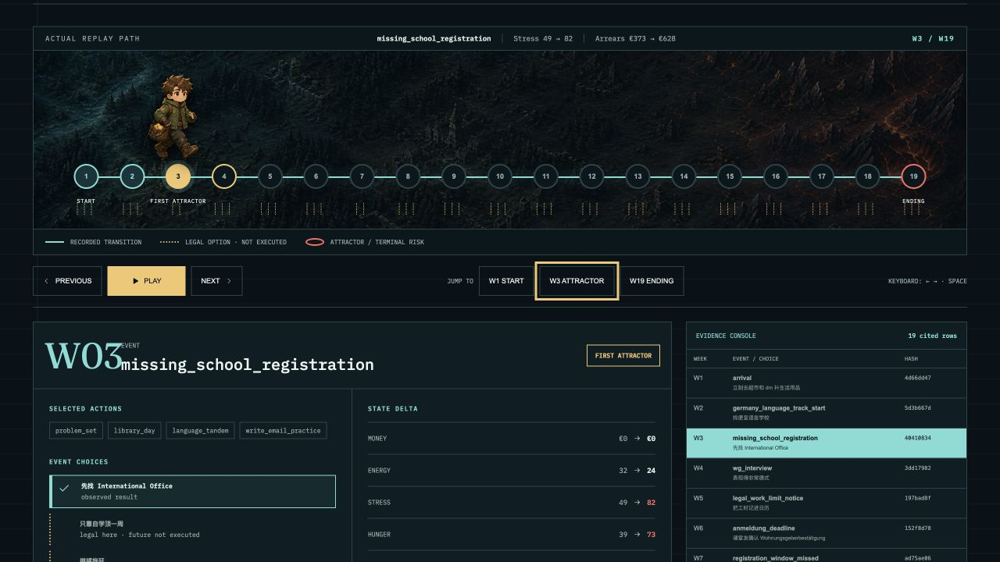
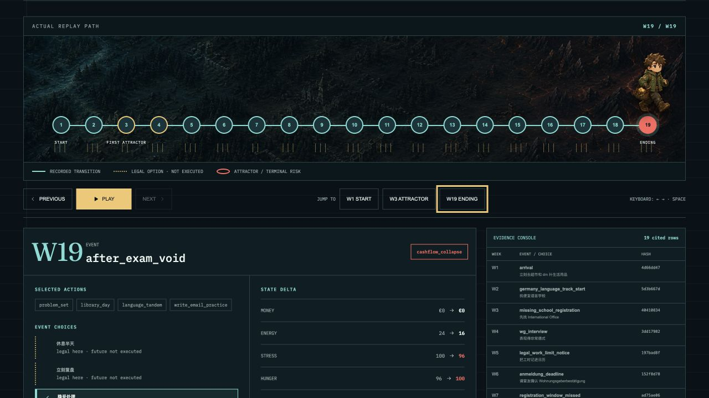
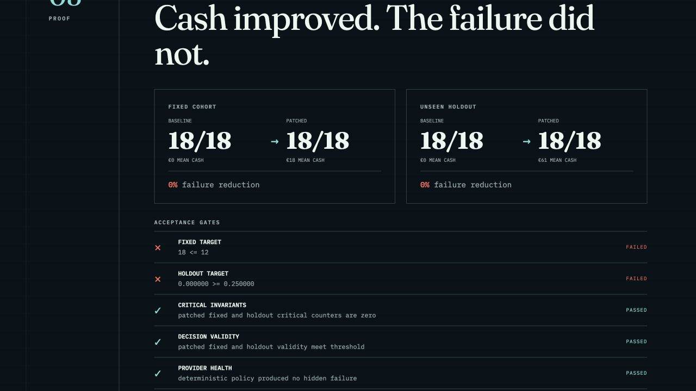

# 90 秒比赛评审路线审计

Date: 2026-07-17
Surface: formal Judge Mission and Playthrough Inspector
Viewport: 1280 × 720
Mode: combined UX and accessibility audit
Evidence rule: every finding below is based on screenshots and DOM behavior captured in this audit run.

## 1. Audit scope

评审任务是从比赛首页理解项目主张，检查 Money 策略证据，进入实际 `money · seed 42` 回放，定位 W3 首个吸引子和 W19 终局，再返回 Proof 理解为什么候选修复被拒绝。

目标不是浏览所有功能，而是在 90 秒内回答五个问题：

1. 项目做什么？
2. 六种 Persona 是否真的产生了测试证据？
3. 代表性路径是否来自实际 Godot Replay？
4. 失败怎样在路径中形成？
5. 为什么修复没有合并？

## 2. Flow steps and health

### Step 1 — Judge Mission 起点：healthy

- 主标题与 `REJECTED` 在首屏内建立了清晰的比赛命题。
- `18/18`、342 节点、324 实际边和 truth label 同时出现，可信度建立得很快。
- 1280×720 下 Persona 下半部分位于折线附近，但角色系统已进入首屏，属于可接受的 P3 密度问题。

### Step 2 — Money 策略详情：fixed, now healthy

修复前：

- **P1：**详情抽屉只有关闭动作，进入签名回放需要关闭抽屉并继续寻找页面 CTA，打断 90 秒路线。
- **P2 accessibility：**打开后焦点仍停留在背景 Persona 按钮；视觉上出现模态层，但键盘上下文没有同步进入对话框。

修复后：

- 在抽屉首屏增加 `Inspect Money seed 42 replay` 主动作，直接进入代表性证据。
- 打开时焦点进入关闭按钮；Tab 在关闭按钮与 Replay 链接之间循环；Escape 关闭后焦点返回 Money Persona。
- 策略 contract、observed behavior、ending 和证据入口现在构成一条连续阅读路径。

### Step 3 — Inspector W1：healthy

- 19 个实际节点、18 条 recorded transitions、合法但未执行的选择和人物 runner 在同一画面中。
- Previous / Play / Next 与 W1/W3/W19 跳转按钮均可发现。
- `prerecorded-real-godot-replay` 在页面顶栏持续可见，没有把 Replay 误说成实时模型运行。

### Step 4 — W3 首个吸引子：fixed, now healthy

修复前的详细证据区域：

- **P1：**点击 W3 后 runner 会移动，但事件名、Stress 和 Arrears 的关键变化位于记录区；720p 首屏需要额外滚动才知道“为什么 W3 重要”。

修复后：

- 路径头部现在同步显示 `missing_school_registration`、`Stress 49 → 82`、`Arrears €373 → €628`。
- 评审可以在人物移动的同一视觉上下文中读到因果信号，再决定是否向下检查选择与 hash。
- 详细记录仍保留 observed choice、legal-not-executed choices、状态变化和 Evidence Console。

### Step 5 — W19 终局：healthy

- runner 到达红色终局节点，`cashflow_collapse` 与 W19 记录同步出现。
- Previous 可继续回看，Next 在终局禁用；路径、控制器、记录和 console 状态一致。
- W19 的 €3,862 arrears、16× shortfall 和 row hash 可继续向下检查。

### Step 6 — Proof 与拒绝理由：healthy

- Fixed 与 unseen holdout 都保持 `18/18` failure，`0% failure reduction` 是最有力的拒绝证据。
- failed gates 与 protected passed gates 分开呈现，能说明系统不是“测试全红”，而是关键目标没有达到。
- 页面标题被滚动位置轻微裁切，但核心 cohort 和 gate 证据完整可见；严重度为 P3。

## 3. Strengths

- 视觉记忆点来自人类 Persona 在实际路径上移动，而不是通用数据仪表盘。
- cyan recorded path、amber legal alternatives、coral terminal/rejected 三种语义稳定贯穿两页。
- 实际游戏中文选择与英文证据外壳能够区分 game content 和 evaluator metadata。
- 证据密度高，但每个关键主张都有 truth label、source line 或 row hash 支撑。

## 4. Findings resolved in this pass

| ID | Severity | Finding | Resolution |
| --- | --- | --- | --- |
| A90-01 | P1 | Persona 详情没有直达回放动作 | 在 Money drawer 首屏加入 signed replay CTA |
| A90-02 | P1 | W3/W19 点击后关键状态信号不在路径上下文中 | 路径 header 同步 event、Stress、Arrears |
| A90-03 | P2 a11y | Modal 打开后焦点停留在背景，且没有焦点循环 | 初始聚焦 close、Tab trap、Escape focus return |

当前没有未解决的 P0、P1 或 P2。

## 5. Remaining P3 opportunities

- 1280×720 Judge 首屏只能看到 Persona 上半部分；现场讲解需要一次自然下滚。
- Proof 标题通过程序化 `scrollIntoView` 时会被顶部边界裁切；可在演示脚本中使用稍小的滚动偏移。
- 2.6 MB 地图 PNG 和约 773 KB 的主 JS chunk 仍适合在部署前做 WebP/AVIF 与路由级 code splitting。
- 中英文混排是实际 game data 的结果，但讲解人需要明确：中文是游戏内容，英文是评审证据层。

## 6. Accessibility evidence and limits

本轮确认了语义 heading/region/dialog、按钮和链接名称、键盘焦点进入与返回、dialog focus loop、终局 disabled state，以及 DOM 中持续的 truth label。截图无法证明完整 WCAG 合规；本轮没有重新运行屏幕阅读器、200% zoom、自动对比度计算或不同操作系统的 reduced-motion 实测。

## 7. Verification

- `npm test -- --run`: 17/17 passed.
- `npm run build`: passed.
- Browser flow: Judge → Money drawer → direct replay → W3 → W19 → Proof passed.
- Final audit status: **passed with P3 follow-ups only**.
