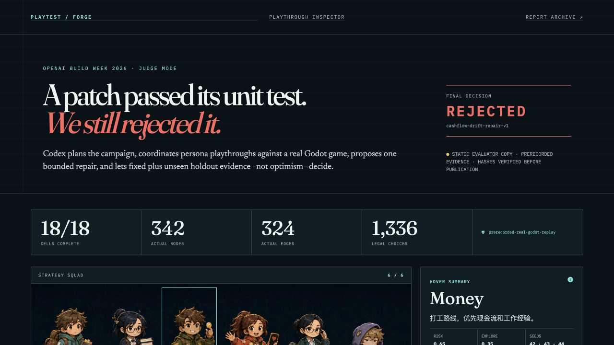
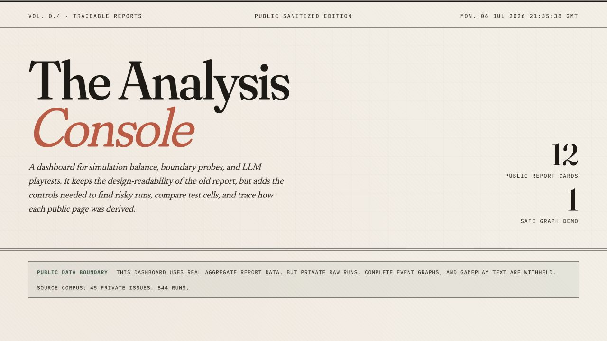
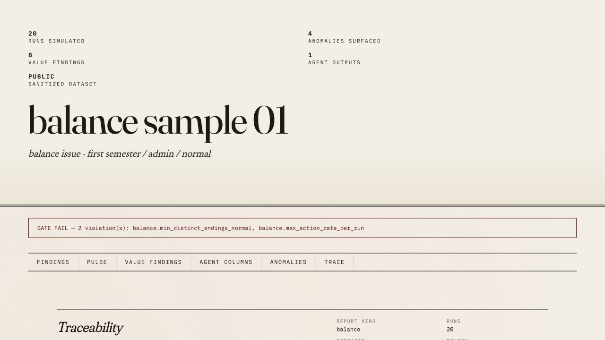
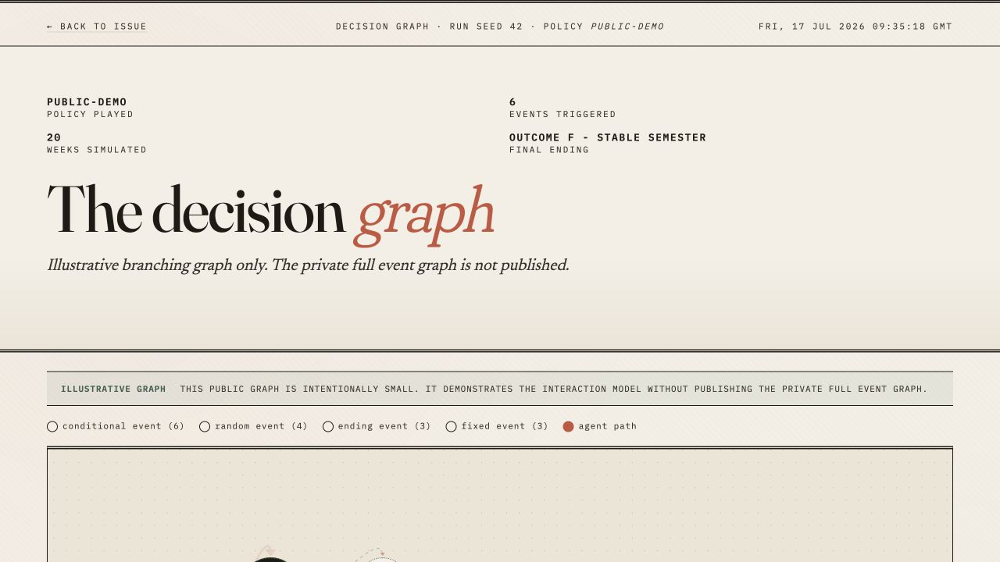
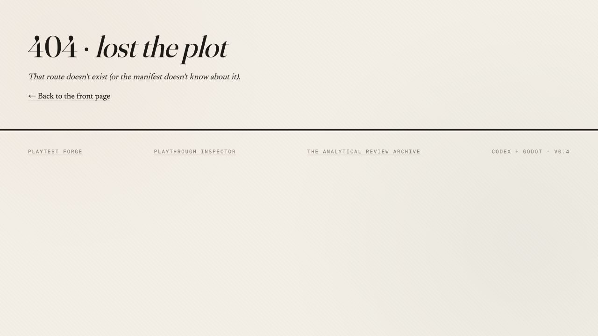

# Auxiliary-page visual migration audit

Date: 2026-07-17

Scope: compare the competition-critical Judge Mission and Playthrough Inspector
visual language with the current Report Archive, Issue Detail, Decision Graph,
and not-found routes. This is a read-only product-design audit; no frontend code
was changed.

## Overall verdict

The user's observation is correct. The frontend currently ships two visual
systems:

- Judge Mission and Playthrough Inspector use the approved dark game-testing
  command-center language: cyan evidence, amber alternatives, coral risk,
  Persona imagery, compact signed-state panels, and a shared competition nav.
- Report Archive, Issue Detail, Decision Graph, and not-found states still use
  the earlier cream editorial-report language from `global.css`.

The auxiliary pages are individually coherent, but the transition from a core
page looks like a product switch. For a competition review, this weakens the
claim that the product is one purpose-built tool for game developers.

## Captured flow

### Step 1 — Core visual baseline — healthy

The Judge page has a clear signature: dark evidence environment, compact
instrument-like metrics, direct verdict hierarchy, character strategy system,
and consistent cyan/amber/coral semantics.

### Step 2 — Report Archive — needs migration

Strengths: filters, report counts, cards, and public-data boundary are clear.

Issues:

- The cream editorial cover, oversized title, and terracotta accent do not
  match the competition pages.
- The first viewport spends most of its height on branding before the evaluator
  sees a usable report card.
- The page has no competition command-center header, so product location and
  return path are weaker.
- Copy still emphasizes sanitized/public data although the current competition
  build is allowed to show actual data.

### Step 3 — Issue Detail — needs migration

Strengths: traceability, gate status, anchor navigation, tables, charts, graph,
and agent summary form a useful evidence dossier.

Issues:

- The title and empty cream space dominate the first viewport while the actual
  diagnosis starts below the fold.
- Gate failure, provenance, findings, graph, and anomalies are visually equal;
  there is no judge-oriented reading order.
- The page looks like a printed report rather than a game test investigation.
- The embedded graph and standalone graph inherit a different visual grammar
  from the Inspector route.

### Step 4 — Decision Graph — highest-priority migration

Strengths: it is the strongest auxiliary capability—interactive nodes,
triggered path, timeline, replay controls, branch inspection, and state effects.

Issues:

- It is visually the closest concept to Playthrough Inspector, yet it looks the
  least connected because it retains the cream editorial cover and terracotta
  path semantics.
- The initial viewport exposes mostly title and an empty portion of the graph;
  the selected event, path state, and controls are not immediately legible.
- The graph legend does not reuse the core meanings: cyan committed evidence,
  amber legal/unexecuted branches, coral attractor/terminal risk.
- The page says “illustrative graph,” which is weaker than the actual-evidence
  story now available in the competition branch.

### Step 5 — Not-found and system states — inconsistent

The route is functional and has a recovery link, but it retains the old theme,
has no shared competition header, and does not feel like an intentional state
of the same product. Loading, error, and empty results use the same old global
theme and need to migrate with it.

## Root cause

`frontend/src/main.tsx` loads both `global.css` and `competition.css` globally.
The root `body`, archive components, issue components, graph components, and
system states inherit the cream tokens from `global.css`. The dark system is
implemented as route-specific `.judge-*` and `.playthrough-*` overrides rather
than a reusable application shell and token layer.

This means changing individual backgrounds would leave typography, spacing,
navigation, severity semantics, tables, controls, focus states, and empty/error
states inconsistent.

## Recommended next phase

### P0 — Extract the competition design system

Create one reusable dark product shell before migrating pages:

- shared top navigation and footer;
- semantic tokens for evidence, legal alternative, warning, rejected/risk,
  success, surface, rules, muted copy, and focus;
- shared page heading, metric strip, evidence panel, status chip, toolbar,
  table, empty/error/loading state, and provenance footer;
- route-aware active navigation and a stable “back to evidence” pattern;
- preserve Fraunces/Newsreader/IBM Plex Mono, but assign consistent display,
  narrative, and data roles.

Definition of done: a page can opt into the new shell without importing
Judge-specific layout classes, and no new component depends directly on the
cream paper tokens.

### P0 — Migrate Decision Graph first

Rename its evaluator-facing role to **Decision Graph Lab** and make it the deep
analysis continuation of Playthrough Inspector:

- compact evidence header instead of the oversized editorial cover;
- reuse cyan for the executed path, amber for legal branches, and coral for
  attractor/terminal risk;
- keep the selected event, current week, runner/Persona, controls, and state
  effects visible together in the first viewport;
- reuse the actual event/choice/provenance language from Inspector;
- preserve React Flow behavior, zoom, timeline, play/pause, and node details.

Why first: this is the auxiliary page most likely to make judges say “this is a
real game-development tool,” and it already contains the highest-value
interaction model.

### P1 — Migrate Issue Detail second

Reframe it as an **Evidence Dossier**:

- lead with gate decision, failure cluster, affected Personas/seeds, and one
  plain-language conclusion;
- move provenance and exact hashes into a persistent evidence rail;
- render tables and charts as dark diagnostic modules;
- keep the anchor rail sticky and expose graph, anomalies, and agent findings as
  investigation tabs;
- embed the migrated Decision Graph Lab instead of the old themed graph.

### P1 — Migrate Report Archive third

Reframe it as **Mission Archive** or **Test Campaign Archive**:

- replace the editorial cover with a compact command-center header;
- expose searchable campaign cards in the first viewport;
- add Persona, outcome, severity, provider/evidence type, and seed filters;
- use the same verdict and provenance chips as the core pages;
- remove obsolete sanitized-data messaging where the competition branch now
  shows actual committed evidence.

### P2 — Migrate system states and finish navigation

- not-found, loading, API error, empty filter results, unavailable graph;
- shared keyboard focus treatment and reduced-motion behavior;
- one global navigation model across all five product routes;
- responsive QA at desktop, tablet, and 390 px mobile.

## Suggested implementation order and ownership

| Work package | Primary files | Priority | Estimate |
| --- | --- | --- | --- |
| Shared dark shell and tokens | `App.tsx`, `global.css`, `competition.css`, new shared components | P0 | 1 day |
| Decision Graph Lab | `DecisionGraphPage.tsx`, graph styles | P0 | 1–1.5 days |
| Evidence Dossier | `IssuePage.tsx`, shared table/chart modules | P1 | 1.5–2 days |
| Mission Archive | `FrontPage.tsx`, filters/cards | P1 | 1 day |
| 404/loading/error/empty states | `NotFoundPage.tsx`, API state components | P2 | 0.5 day |
| Interaction and responsive QA | tests and browser captures | P0 gate | 0.5–1 day |

## Recommended competition route

Judge Mission → Persona detail → Playthrough Inspector → Decision Graph Lab →
Evidence Dossier → Mission Archive.

Every step should answer a progressively deeper question:

1. What did the system discover?
2. Which strategy produced it?
3. What happened week by week?
4. Which branches existed and which path executed?
5. What exact evidence supports the conclusion?
6. What other campaigns can the evaluator inspect?

## Accessibility risks and audit limits

The captured DOM shows labels for filters, route controls, graph zoom controls,
and most navigation. Screenshots alone cannot prove contrast ratios, focus
order, screen-reader announcements, drag alternatives, or reduced-motion
behavior. Those must be tested during migration. Visually, the old theme's thin
mono labels and subtle paper rules are at greater risk of low contrast than the
core dark theme, especially on smaller screens.

## Decision

Do not translate events next. First migrate the shared shell and Decision Graph
Lab. That closes the largest competition-level visual break while strengthening
the most impressive auxiliary capability. Then migrate Issue Detail, Report
Archive, and system states in that order.
