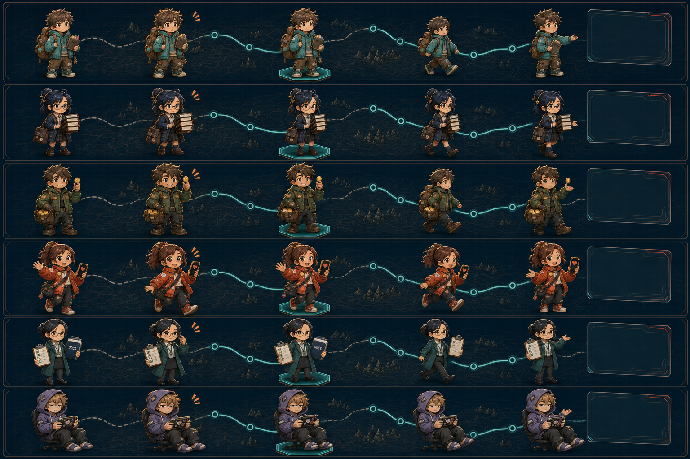

# Persona motion storyboard review

Status: `review-ready · visual-reference-only`

Asset SHA-256:
`e734e0ce662b0e8c5a241b41be91e508fccaac8fc6864ed5c08522d533058627`

## Purpose

This board defines the visual transition from Judge Mission Persona selection
to Playthrough Inspector playback. It is a character-motion reference, not a
playthrough data source. The decorative path behind each character must be
replaced by the verified route from the selected cell JSON.

The row order is fixed:

1. Newbie;
2. Study;
3. Money;
4. Social;
5. Visa;
6. Slacker.

Each row contains five character states followed by a blank detail-panel slot:

1. idle;
2. hover response;
3. selected on the teal route pedestal;
4. movement between observed nodes;
5. detail-open gesture;
6. evidence panel reserved for exact UI copy and metrics.

## Review result

### Passed

- All six characters remain human strategy Personas; no Codex, robot, or extra
  mascot appears.
- Hair, outfit, props, palette, and proportions remain recognizable across the
  five states.
- Selected state is consistently anchored to a teal observed-node pedestal.
- The motion direction reads left to right and supports the Inspector playback
  mental model.
- The blank evidence panel prevents generated pseudo-text or invented metrics.
- Money remains visually suitable as the default judging demo Persona.

### Must remain explicit in Figma and implementation

- The background paths are decorative. They do not represent the actual
  `money · seed 42` W1–W19 topology.
- Hover copy, detail data, node count, events, actions, and legal choices must
  come from the retained JSON views.
- Unselected legal choices remain short dotted stubs; this asset does not grant
  permission to project their future states.
- Orange hover attention marks are a character reaction only. The product UI
  should rely on the amber outline and must reserve coral for failure/detail
  alerts.
- Slacker intentionally remains seated during movement. Implement this as a
  slow chair glide or small roll between nodes, not a generic walking cycle.

## Proposed motion mapping

| Storyboard state | Product behavior | Timing | Reduced motion |
| --- | --- | --- | --- |
| Idle | Subtle breathing or prop movement | 1,600–2,400 ms loop | Static pose |
| Hover | Lean/react and reveal compact evidence card | 120 ms | Card opacity only |
| Selected | Lock to teal node pedestal | 180 ms | Immediate outline |
| Move | Advance exactly one observed edge | 280 ms | Immediate position change |
| Detail open | Turn toward persistent evidence panel | 180 ms | Immediate panel |

The character position, selected graph node, state delta, event card, and log
row must update as one playback transaction.

## Approval checklist

- [ ] Character identity consistency;
- [ ] five-state sequence;
- [ ] Money as default demo Persona;
- [ ] Slacker seated movement treatment;
- [ ] amber hover versus coral alert semantics;
- [ ] motion timing and reduced-motion behavior;
- [ ] use only with evidence-backed graph data.
