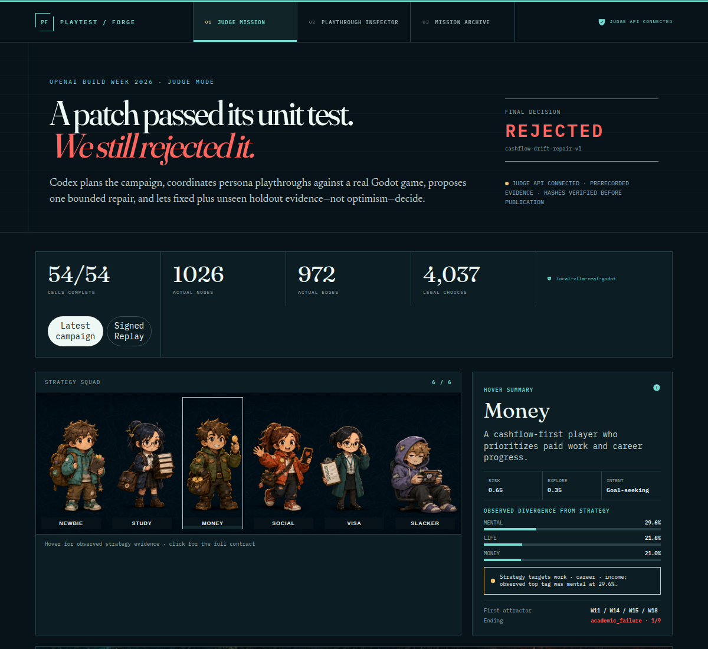
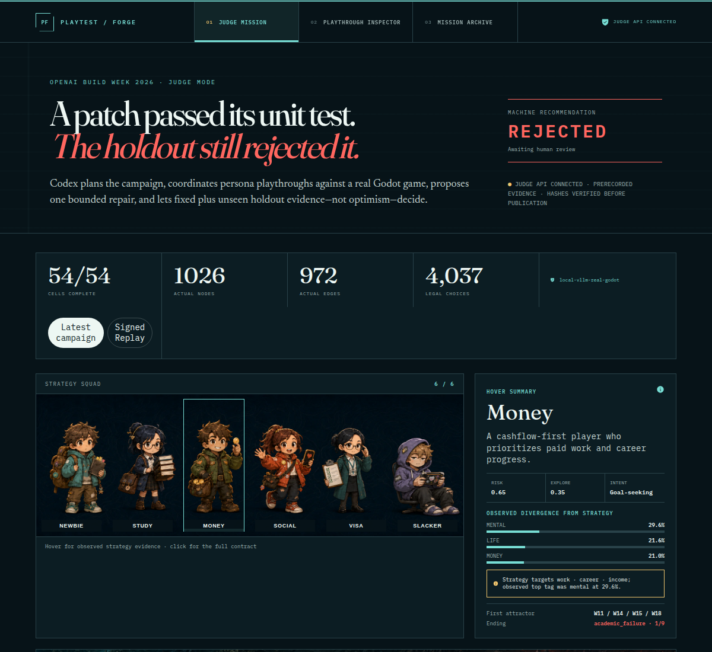
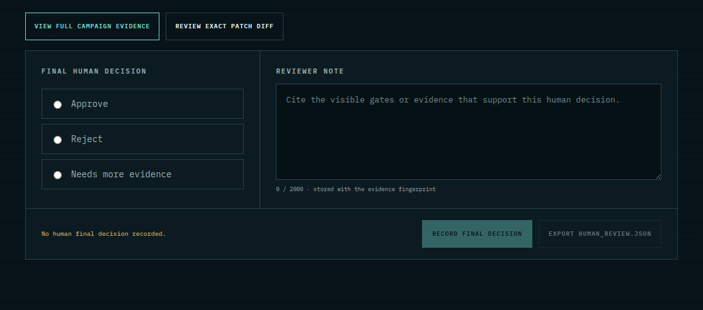
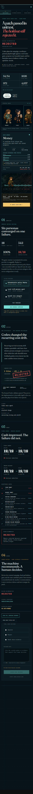

# Human Decision frontend integration review

Date: 2026-07-17
Status: implemented and visually reviewed
Scope: Judge Mission machine recommendation and minimal human final-decision layer

## Outcome

Human Decision belongs inside the existing Judge evidence journey as stage 04,
after the machine proof, not in a separate review product:

```text
01 Campaign → 02 Repair → 03 Proof / machine recommendation → 04 Human / final decision
```

This preserves the competition thesis: Codex and deterministic gates produce
auditable evidence and a recommendation; a named human decision is recorded
against that same evidence without rewriting it or merging the patch.

## Competition and product fit

The Build Week entry is a developer tool for bounded, evidence-led game repair.
Its differentiator is not autonomous modification alone, but the visible chain
from real gameplay to a causal hypothesis, candidate patch, fixed/holdout
verification, and an explicit accept/reject boundary. Human review therefore
has to be the terminal governance layer of the Judge experiment.

The minimal interface implements the agreed scope:

- view the retained campaign and exact strategy/seed path;
- view the exact candidate patch diff and its hash;
- preserve the machine recommendation and failed/passed gates;
- choose Approve, Reject, or Needs more evidence;
- require a reviewer note;
- bind the review to the experiment evidence fingerprint;
- export `human_review.json`;
- state and persist `merge_performed: false`.

It deliberately does not create a second evidence model, mutate machine gates,
change the candidate patch, or trigger merge.

## Visual evidence and findings

### Before: unhealthy



The hero presented `Final decision: REJECTED` before any human review existed.
That conflated a machine recommendation with final human authority and anchored
the reviewer toward Reject.


The Human Review panel was a third child of a two-column stage grid. It fell
into the narrow marker column, crushed its copy and controls, and broke the
intended numbered evidence sequence. White rounded fields also read as a
generic SaaS form inside the dark, rectilinear evidence ledger.

Health: **broken** for layout and decision semantics; **weak** for hierarchy,
design-system consistency, and reviewer neutrality.

### After: healthy



Before a review exists, the hero now says `Machine recommendation` and
`Awaiting human review`. No decision radio is preselected. After recording a
review, the hero promotes the human decision while retaining the machine
recommendation as provenance.


Human Review is now a full-width numbered stage 04 after Proof. It uses the
existing dark evidence-ledger surface, serif thesis headings, monospaced
evidence labels, square rules, cyan evidence accents, red failed-machine proof,
and the existing amber token only for the human handoff and selected decision.



The decision legend and reviewer-note label now share the same 11 px monospaced
label treatment and top baseline. The legend is floated into the fieldset content
box so browser-specific legend placement no longer pulls it toward the upper
border.



At 390 px the handoff facts, choices, note, actions, and saved record stack in
reading order without falling into the stage-marker gutter.

Health: **healthy** for desktop and mobile hierarchy, design-language fit,
machine/human distinction, and the core review path.

The full-resolution captures are retained beside these overview images:
`01-current-judge-flow.png`, `05-revised-judge-flow.png`, and
`08-revised-mobile-flow.png`.

## Information architecture

### Stage 03 — Proof owns machine judgment

Proof continues to own fixed/holdout comparisons, acceptance gates, and the
immutable machine recommendation. This is the point where automated evidence
ends. The word “decision” is not used here without the “machine” qualifier.

### Stage 04 — Human owns final disposition

The human stage starts with a compact handoff strip:

1. machine recommendation;
2. evidence fingerprint;
3. no-auto-merge boundary.

It then links back to full campaign evidence and opens the exact patch diff
inside the current Judge page. The latter uses an in-page function instead of a
literal hash link because this application uses HashRouter; a normal
`#candidate-patch-diff` would become an application route.

The form starts with no selected option to avoid anchoring. A decision and a
nonblank note are required. The durable record displays machine recommendation,
human decision, override status, evidence fingerprint, timestamp, note, and
`merge_performed: false`.

## Design-language rationale

No new palette, card system, icon language, or type scale was invented. The
integration reuses the competition frontend's established visual grammar:

| Role | Existing language | Human Decision use |
| --- | --- | --- |
| thesis | serif display type | stage heading and decision framing |
| evidence | mono labels and values | fingerprint, recommendation, record |
| verified path | cyan | evidence link and stable identifiers |
| failed proof | red | rejected machine recommendation |
| human attention | amber | handoff boundary and selected choice |
| structure | dark rectilinear ledger | stage, form, handoff, saved record |

Amber does not mean “pass”; it means “human attention required.” Approve,
Reject, and Needs more evidence remain explicit text so color is never the only
signal.

## Accessibility and interaction review

Implemented strengths:

- semantic stage headings and a labelled review region;
- radio inputs grouped by `fieldset` and `legend`;
- visible text labels for every decision and the reviewer note;
- 44 px minimum evidence-link targets;
- polite live status for save/error state;
- required note, 2,000-character limit, and visible counter;
- native `details` for the exact diff, opened and focused by the review link;
- no color-only outcome labels;
- keyboard-operable native controls.

Residual validation limits:

- screenshots cannot prove screen-reader announcement quality or complete
  keyboard order;
- contrast was visually checked against existing tokens but not independently
  measured in this pass;
- the localhost Judge API is not a hosted authenticated review system.

These limits do not block the Build Week minimal human-review capability, but
should be included in any later production accessibility audit.

## Verification

The focused frontend suite covers:

- machine recommendation versus awaiting-human-review semantics;
- no preselected human decision;
- all review evidence and exact patch diff content;
- patch diff expansion without a HashRouter route change;
- required decision/note submission;
- evidence-fingerprint-bound API request;
- `human_review.json` export;
- explicit no-merge result.

Backend coverage verifies stale-fingerprint rejection, durable record output,
all three allowed decisions, nonblank reviewer notes, and
`merge_performed: false`.

## Review conclusion

The revised integration now matches the competition story and the implemented
evidence model. The Judge page remains one coherent evaluator surface: machine
proof is visible and immutable, human authority is explicit and final, and
neither approval nor rejection can silently modify evidence or merge code.
